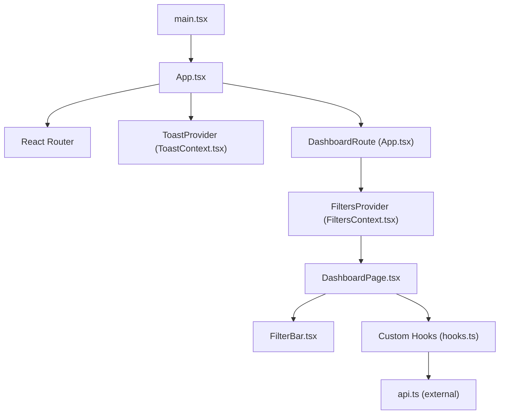
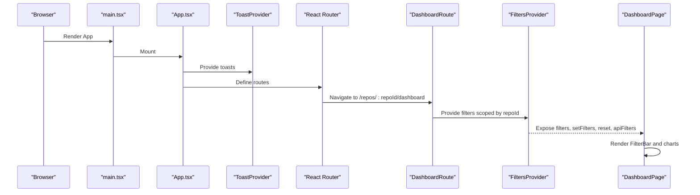
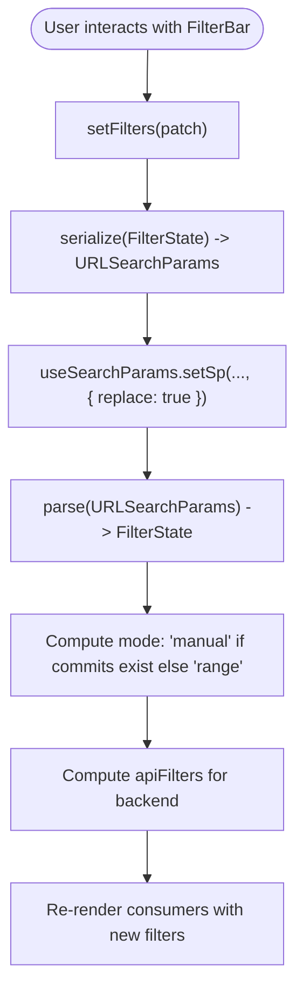
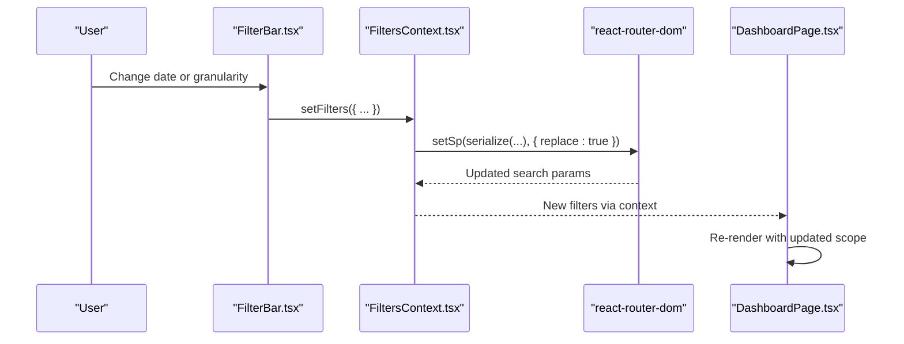
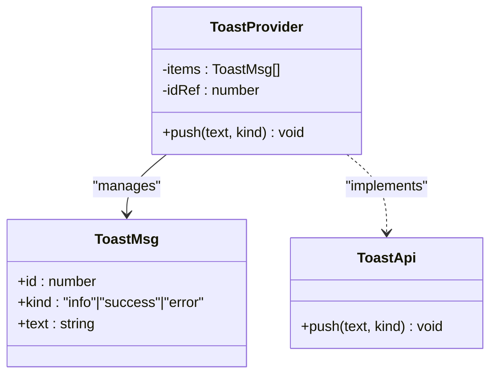
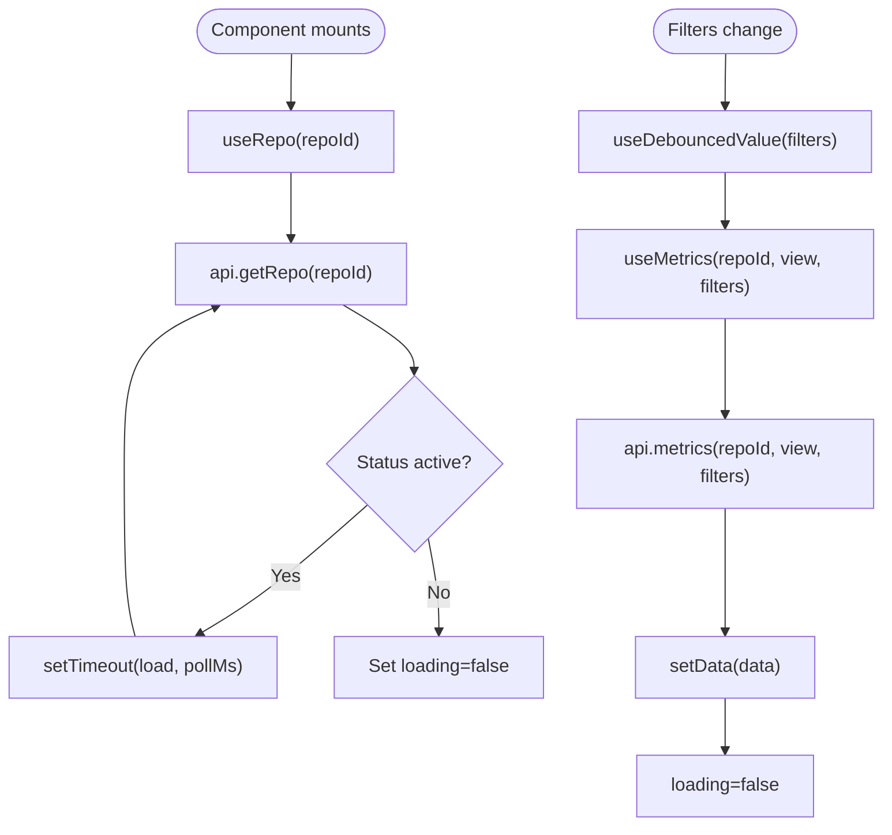
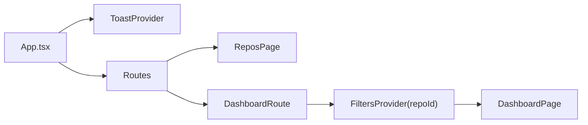
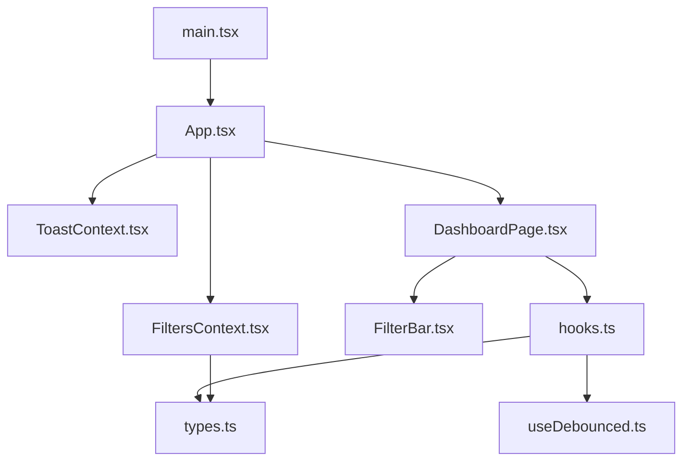

# State Management

<cite>
**Referenced Files in This Document**
- [FiltersContext.tsx](file://frontend/src/state/FiltersContext.tsx)
- [ToastContext.tsx](file://frontend/src/state/ToastContext.tsx)
- [hooks.ts](file://frontend/src/lib/hooks.ts)
- [App.tsx](file://frontend/src/App.tsx)
- [main.tsx](file://frontend/src/main.tsx)
- [FilterBar.tsx](file://frontend/src/components/FilterBar.tsx)
- [DashboardPage.tsx](file://frontend/src/pages/DashboardPage.tsx)
- [useDebounced.ts](file://frontend/src/lib/useDebounced.ts)
- [types.ts](file://frontend/src/types.ts)
</cite>

## Table of Contents
1. [Introduction](#introduction)
2. [Project Structure](#project-structure)
3. [Core Components](#core-components)
4. [Architecture Overview](#architecture-overview)
5. [Detailed Component Analysis](#detailed-component-analysis)
6. [Dependency Analysis](#dependency-analysis)
7. [Performance Considerations](#performance-considerations)
8. [Troubleshooting Guide](#troubleshooting-guide)
9. [Conclusion](#conclusion)

## Introduction
This document explains the frontend state management architecture built with React Context API. It covers:
- Global state design patterns and provider composition
- URL-synchronized filter state for shareable, bookmarkable dashboard views
- Toast notifications for user feedback
- Custom hooks for data fetching, polling, debouncing, and UI interactions
- Examples of consuming and updating global state
- Performance optimization techniques used throughout the application

The goal is to make the system understandable for both developers and non-developers while providing precise references to the source code.

## Project Structure
The state-related code lives under `frontend/src`:
- `state/` contains context providers for filters and toasts
- `lib/` contains reusable hooks and utilities
- `components/` and `pages/` consume contexts and hooks to render UI
- `App.tsx` composes providers and routes
- `main.tsx` bootstraps the app

**Diagram sources**
- [main.tsx:9-13](file://frontend/src/main.tsx#L9-L13)
- [App.tsx:21-36](file://frontend/src/App.tsx#L21-L36)
- [FiltersContext.tsx:70-112](file://frontend/src/state/FiltersContext.tsx#L70-L112)
- [ToastContext.tsx:17-43](file://frontend/src/state/ToastContext.tsx#L17-L43)
- [DashboardPage.tsx:17-95](file://frontend/src/pages/DashboardPage.tsx#L17-L95)
- [FilterBar.tsx:9-93](file://frontend/src/components/FilterBar.tsx#L9-L93)
- [hooks.ts:13-124](file://frontend/src/lib/hooks.ts#L13-L124)

**Section sources**
- [main.tsx:1-14](file://frontend/src/main.tsx#L1-L14)
- [App.tsx:1-38](file://frontend/src/App.tsx#L1-L38)

## Core Components
This section summarizes the core stateful modules and their responsibilities.

- FiltersContext
  - Maintains application-wide filter state synchronized with the URL query string
  - Exposes a provider and a typed hook for reading/updating filters
  - Derives backend-ready filters and a mode flag indicating manual vs range selection
- ToastContext
  - Provides a simple notification system with auto-dismiss
  - Exposes a provider and a hook to push messages
- Custom Hooks (hooks.ts)
  - useRepo: fetches repository info with polling while ingestion is active
  - useMetrics: SWR-style metrics fetching with debounced keys and stale-data preservation
  - useAuthors: fetches author metadata with reload capability
  - useClickOutside: utility for closing dropdowns on outside clicks
- Supporting Utilities
  - useDebouncedValue: returns a delayed value to debounce filter-driven requests
  - types.ts: shared TypeScript interfaces for API contracts and domain models

**Section sources**
- [FiltersContext.tsx:1-119](file://frontend/src/state/FiltersContext.tsx#L1-L119)
- [ToastContext.tsx:1-48](file://frontend/src/state/ToastContext.tsx#L1-L48)
- [hooks.ts:1-142](file://frontend/src/lib/hooks.ts#L1-L142)
- [useDebounced.ts:1-12](file://frontend/src/lib/useDebounced.ts#L1-L12)
- [types.ts:1-172](file://frontend/src/types.ts#L1-L172)

## Architecture Overview
The application composes two top-level providers:
- ToastProvider wraps the entire app to provide toast notifications globally
- FiltersProvider wraps only the dashboard route to scope filter state per repository

**Diagram sources**
- [main.tsx:9-13](file://frontend/src/main.tsx#L9-L13)
- [App.tsx:21-36](file://frontend/src/App.tsx#L21-L36)
- [FiltersContext.tsx:70-112](file://frontend/src/state/FiltersContext.tsx#L70-L112)
- [DashboardPage.tsx:17-95](file://frontend/src/pages/DashboardPage.tsx#L17-L95)

## Detailed Component Analysis

### FiltersContext: Global Filter State and URL Synchronization
FiltersContext implements a single source of truth for dashboard filters that is persisted in the URL. Consumers read from the context and update via a typed setter that serializes changes back into the URL. The provider also computes:
- A derived mode: “range” when using time windows, “manual” when a commit list is selected
- Backend-ready filters (apiFilters) translating UI values to the API contract

Key behaviors:
- Parsing and serialization of URL parameters ensure shareable links
- Debounced updates are not needed here because react-router’s useSearchParams handles stable updates; instead, useMemo and useCallback optimize re-renders
- Reset clears all filters by replacing the search params with an empty object

**Diagram sources**
- [FiltersContext.tsx:24-55](file://frontend/src/state/FiltersContext.tsx#L24-L55)
- [FiltersContext.tsx:80-108](file://frontend/src/state/FiltersContext.tsx#L80-L108)

Consumption example:
- DashboardPage reads repoId and filters, then renders FilterBar and other components
- FilterBar calls setFilters to update start/end dates, granularity, authors, and commit selections

**Diagram sources**
- [FilterBar.tsx:9-93](file://frontend/src/components/FilterBar.tsx#L9-L93)
- [FiltersContext.tsx:70-112](file://frontend/src/state/FiltersContext.tsx#L70-L112)
- [DashboardPage.tsx:17-95](file://frontend/src/pages/DashboardPage.tsx#L17-L95)

**Section sources**
- [FiltersContext.tsx:1-119](file://frontend/src/state/FiltersContext.tsx#L1-L119)
- [FilterBar.tsx:1-93](file://frontend/src/components/FilterBar.tsx#L1-L93)
- [DashboardPage.tsx:1-95](file://frontend/src/pages/DashboardPage.tsx#L1-L95)

### ToastContext: User Feedback Management
ToastContext provides a minimal notification system:
- push(text, kind?) adds a message with a unique id and auto-dismiss after a timeout
- The provider renders a live region for accessibility and maps each toast to a styled element
- Consumers call useToast().push() anywhere in the tree

**Diagram sources**
- [ToastContext.tsx:5-13](file://frontend/src/state/ToastContext.tsx#L5-L13)
- [ToastContext.tsx:17-43](file://frontend/src/state/ToastContext.tsx#L17-L43)

Usage pattern:
- Any component can call useToast().push("Operation completed", "success") to show a transient message

**Section sources**
- [ToastContext.tsx:1-48](file://frontend/src/state/ToastContext.tsx#L1-L48)

### Custom Hooks: Data Fetching Patterns
The custom hooks encapsulate common data-fetching logic and lifecycle management.

- useRepo(repoId, pollMs)
  - Fetches repository info and polls while status indicates active ingestion
  - Handles loading/error states and cleanup on unmount
- useMetrics<T>(repoId, view, filters, enabled)
  - Debounces filter changes to avoid excessive network requests
  - Preserves stale data until new data arrives, preventing chart flicker
  - Supports manual reload via nonce increment
- useAuthors(repoId)
  - Fetches author metadata and exposes reload
- useClickOutside(ref, onOutside)
  - Closes dropdown panels when clicking outside

**Diagram sources**
- [hooks.ts:13-49](file://frontend/src/lib/hooks.ts#L13-L49)
- [hooks.ts:51-99](file://frontend/src/lib/hooks.ts#L51-L99)
- [useDebounced.ts:1-12](file://frontend/src/lib/useDebounced.ts#L1-L12)

**Section sources**
- [hooks.ts:1-142](file://frontend/src/lib/hooks.ts#L1-L142)
- [useDebounced.ts:1-12](file://frontend/src/lib/useDebounced.ts#L1-L12)

### Provider Composition and Routing
App.tsx composes providers and routes:
- ToastProvider wraps the entire app
- DashboardRoute wraps DashboardPage with FiltersProvider scoped by repoId
- Routes map to ReposPage, DashboardPage, and AuthorsPage

**Diagram sources**
- [App.tsx:10-19](file://frontend/src/App.tsx#L10-L19)
- [App.tsx:21-36](file://frontend/src/App.tsx#L21-L36)

**Section sources**
- [App.tsx:1-38](file://frontend/src/App.tsx#L1-L38)

## Dependency Analysis
The following diagram shows how components and contexts depend on each other:

**Diagram sources**
- [main.tsx:1-14](file://frontend/src/main.tsx#L1-L14)
- [App.tsx:1-38](file://frontend/src/App.tsx#L1-L38)
- [ToastContext.tsx:1-48](file://frontend/src/state/ToastContext.tsx#L1-L48)
- [FiltersContext.tsx:1-119](file://frontend/src/state/FiltersContext.tsx#L1-L119)
- [DashboardPage.tsx:1-95](file://frontend/src/pages/DashboardPage.tsx#L1-L95)
- [FilterBar.tsx:1-93](file://frontend/src/components/FilterBar.tsx#L1-L93)
- [hooks.ts:1-142](file://frontend/src/lib/hooks.ts#L1-L142)
- [useDebounced.ts:1-12](file://frontend/src/lib/useDebounced.ts#L1-L12)
- [types.ts:1-172](file://frontend/src/types.ts#L1-L172)

**Section sources**
- [main.tsx:1-14](file://frontend/src/main.tsx#L1-L14)
- [App.tsx:1-38](file://frontend/src/App.tsx#L1-L38)
- [FiltersContext.tsx:1-119](file://frontend/src/state/FiltersContext.tsx#L1-L119)
- [ToastContext.tsx:1-48](file://frontend/src/state/ToastContext.tsx#L1-L48)
- [hooks.ts:1-142](file://frontend/src/lib/hooks.ts#L1-L142)
- [useDebounced.ts:1-12](file://frontend/src/lib/useDebounced.ts#L1-L12)
- [types.ts:1-172](file://frontend/src/types.ts#L1-L172)

## Performance Considerations
- URL synchronization without extra state duplication
  - FiltersContext uses useMemo for parsing and serialization, and useCallback for setters to minimize unnecessary re-renders
  - URL-based state ensures deep-linking and sharing without additional sync mechanisms
- Debounced metric queries
  - useMetrics combines useDebouncedValue to delay network requests while users adjust filters, reducing server load and improving UX
- Stale data preservation
  - useMetrics keeps previous data until new data arrives, avoiding empty chart flashes during transitions
- Polling with cleanup
  - useRepo sets timers conditionally based on repository status and cleans them up on unmount to prevent memory leaks
- Provider scoping
  - FiltersProvider is scoped to the dashboard route, limiting its influence to relevant components and reducing unnecessary re-renders elsewhere

[No sources needed since this section provides general guidance]

## Troubleshooting Guide
Common issues and resolutions:
- Missing FiltersProvider error
  - Symptom: Error thrown when calling useFilters outside FiltersProvider
  - Resolution: Ensure DashboardRoute wraps DashboardPage with FiltersProvider(repoId)
- No URL updates observed
  - Symptom: Changing inputs does not reflect in the URL
  - Resolution: Verify setFilters is called and that useSearchParams is available within BrowserRouter
- Toasts not appearing
  - Symptom: Calling useToast().push has no effect
  - Resolution: Confirm ToastProvider wraps the app in App.tsx and that the component is inside the provider tree
- Excessive network requests
  - Symptom: Too many API calls when changing filters rapidly
  - Resolution: Rely on useMetrics debouncing; avoid bypassing it by directly calling api.metrics in components

**Section sources**
- [FiltersContext.tsx:114-118](file://frontend/src/state/FiltersContext.tsx#L114-L118)
- [App.tsx:10-19](file://frontend/src/App.tsx#L10-L19)
- [ToastContext.tsx:17-43](file://frontend/src/state/ToastContext.tsx#L17-L43)
- [hooks.ts:51-99](file://frontend/src/lib/hooks.ts#L51-L99)

## Conclusion
The frontend state management leverages React Context API to provide:
- A robust, URL-synchronized filter system that enables shareable dashboard views
- A simple, accessible toast notification system
- Reusable data-fetching hooks that handle polling, debouncing, and error states
- Clean provider composition that scopes global state appropriately

By combining these patterns, the application achieves predictable state flow, good performance, and maintainable code.

[No sources needed since this section summarizes without analyzing specific files]