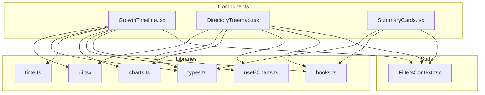
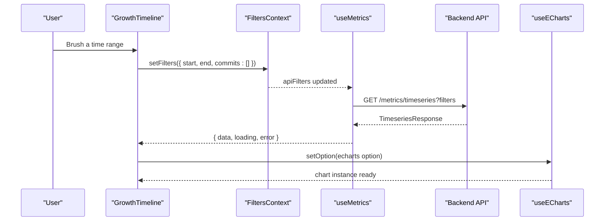
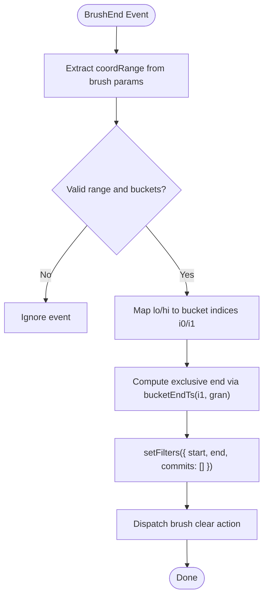
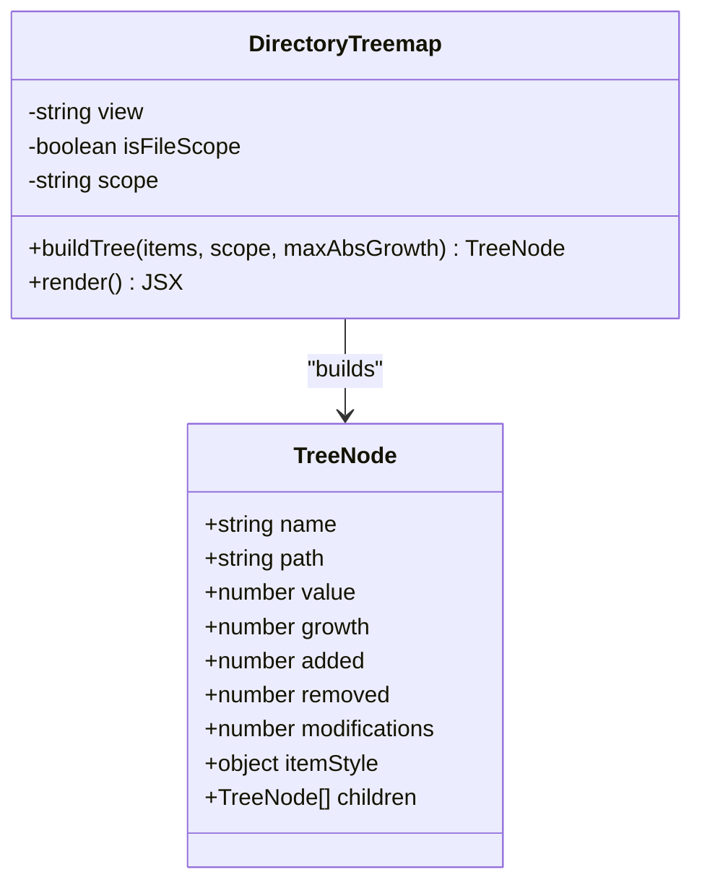
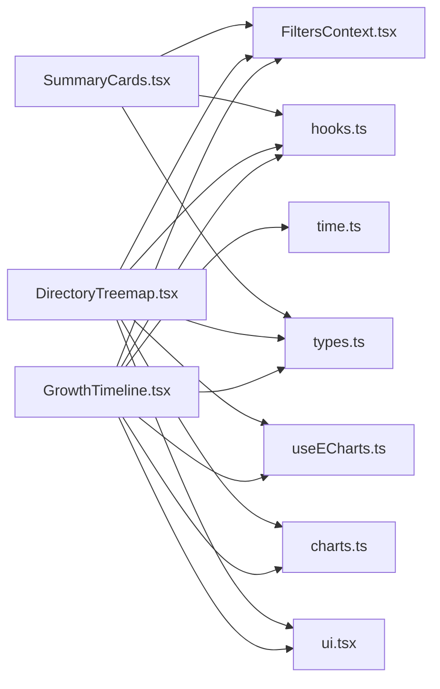

# Chart Components

<cite>
**Referenced Files in This Document**
- [GrowthTimeline.tsx](file://frontend/src/components/GrowthTimeline.tsx)
- [DirectoryTreemap.tsx](file://frontend/src/components/DirectoryTreemap.tsx)
- [SummaryCards.tsx](file://frontend/src/components/SummaryCards.tsx)
- [FiltersContext.tsx](file://frontend/src/state/FiltersContext.tsx)
- [charts.ts](file://frontend/src/lib/charts.ts)
- [hooks.ts](file://frontend/src/lib/hooks.ts)
- [useECharts.ts](file://frontend/src/lib/useECharts.ts)
- [time.ts](file://frontend/src/lib/time.ts)
- [types.ts](file://frontend/src/types.ts)
- [ui.tsx](file://frontend/src/components/ui.tsx)
</cite>

## Table of Contents
1. [Introduction](#introduction)
2. [Project Structure](#project-structure)
3. [Core Components](#core-components)
4. [Architecture Overview](#architecture-overview)
5. [Detailed Component Analysis](#detailed-component-analysis)
6. [Dependency Analysis](#dependency-analysis)
7. [Performance Considerations](#performance-considerations)
8. [Troubleshooting Guide](#troubleshooting-guide)
9. [Conclusion](#conclusion)
10. [Appendices](#appendices)

## Introduction
This document explains the specialized chart components that visualize repository metrics:
- GrowthTimeline: a temporal line chart for added, removed, and growth metrics with interactive brush filtering to set time ranges.
- DirectoryTreemap: a recursive treemap visualization of directory structures with hover tooltips and click-to-scope drill-down.
- SummaryCards: a responsive grid of key metrics with skeleton loading states and sign-aware formatting.

It covers prop interfaces, state management through the shared filter context, integration with the data-fetching hooks, and patterns for customizing appearance or adding new visualization types.

## Project Structure
The chart components live under `frontend/src/components` and rely on shared utilities:
- Shared chart palette and helpers are defined in `lib/charts.ts`.
- Data fetching is centralized in `lib/hooks.ts`, which debounces filters and keeps stale data while new queries run.
- ECharts lifecycle is wrapped by `lib/useECharts.ts`, handling lazy initialization, resize observation, and event binding.
- Time utilities normalize UTC boundaries and bucket end timestamps in `lib/time.ts`.
- Global filter state is provided by `state/FiltersContext.tsx`, syncing URL query parameters to component state.
- Presentational primitives like `ChartState` are in `components/ui.tsx`.
- API contracts and response shapes are declared in `types.ts`.

**Diagram sources**
- [GrowthTimeline.tsx:1-174](file://frontend/src/components/GrowthTimeline.tsx#L1-L174)
- [DirectoryTreemap.tsx:1-198](file://frontend/src/components/DirectoryTreemap.tsx#L1-L198)
- [SummaryCards.tsx:1-84](file://frontend/src/components/SummaryCards.tsx#L1-L84)
- [FiltersContext.tsx:1-119](file://frontend/src/state/FiltersContext.tsx#L1-L119)
- [charts.ts:1-47](file://frontend/src/lib/charts.ts#L1-L47)
- [hooks.ts:51-99](file://frontend/src/lib/hooks.ts#L51-L99)
- [useECharts.ts:1-55](file://frontend/src/lib/useECharts.ts#L1-L55)
- [time.ts:1-44](file://frontend/src/lib/time.ts#L1-L44)
- [types.ts:76-172](file://frontend/src/types.ts#L76-L172)
- [ui.tsx:36-64](file://frontend/src/components/ui.tsx#L36-L64)

**Section sources**
- [GrowthTimeline.tsx:1-174](file://frontend/src/components/GrowthTimeline.tsx#L1-L174)
- [DirectoryTreemap.tsx:1-198](file://frontend/src/components/DirectoryTreemap.tsx#L1-L198)
- [SummaryCards.tsx:1-84](file://frontend/src/components/SummaryCards.tsx#L1-L84)
- [FiltersContext.tsx:1-119](file://frontend/src/state/FiltersContext.tsx#L1-L119)
- [charts.ts:1-47](file://frontend/src/lib/charts.ts#L1-L47)
- [hooks.ts:51-99](file://frontend/src/lib/hooks.ts#L51-L99)
- [useECharts.ts:1-55](file://frontend/src/lib/useECharts.ts#L1-L55)
- [time.ts:1-44](file://frontend/src/lib/time.ts#L1-L44)
- [types.ts:76-172](file://frontend/src/types.ts#L76-L172)
- [ui.tsx:36-64](file://frontend/src/components/ui.tsx#L36-L64)

## Core Components
- GrowthTimeline renders an ECharts line chart over time buckets and lets users select a horizontal range via the toolbox brush. The selection updates the global time-range filter, which drives all other charts.
- DirectoryTreemap builds a hierarchical tree from directory rows, visualizes it as a treemap (or switches to a tree view), and scopes all metrics to the clicked directory path.
- SummaryCards displays seven commit-set metrics plus the size of the selected commit set, using a responsive grid and skeleton placeholders during loading.

Key integration points:
- All components consume `useFilters()` for current filters, mode, and setter functions.
- Data is fetched via `useMetrics(repoId, view, apiFilters)`, which debounces filter changes and preserves previous data until the new response arrives.
- Charts are rendered through `useECharts(option, events)` for safe lifecycle management.

**Section sources**
- [GrowthTimeline.tsx:14-174](file://frontend/src/components/GrowthTimeline.tsx#L14-L174)
- [DirectoryTreemap.tsx:26-198](file://frontend/src/components/DirectoryTreemap.tsx#L26-L198)
- [SummaryCards.tsx:8-84](file://frontend/src/components/SummaryCards.tsx#L8-L84)
- [filtersContext.tsx:57-119](file://frontend/src/state/FiltersContext.tsx#L57-L119)
- [hooks.ts:51-99](file://frontend/src/lib/hooks.ts#L51-L99)
- [useECharts.ts:9-53](file://frontend/src/lib/useECharts.ts#L9-L53)

## Architecture Overview
The chart components follow a consistent pattern:
1. Read global filters from `FiltersContext`.
2. Convert them into backend-compatible `MetricsFilters` via `apiFilters`.
3. Fetch data with `useMetrics`, which debounces and caches requests.
4. Build an ECharts option object using shared palettes and helpers.
5. Render the chart with `useECharts`, wiring interaction handlers to update filters.

**Diagram sources**
- [GrowthTimeline.tsx:118-135](file://frontend/src/components/GrowthTimeline.tsx#L118-L135)
- [FiltersContext.tsx:93-104](file://frontend/src/state/FiltersContext.tsx#L93-L104)
- [hooks.ts:51-99](file://frontend/src/lib/hooks.ts#L51-L99)
- [useECharts.ts:39-41](file://frontend/src/lib/useECharts.ts#L39-L41)

## Detailed Component Analysis

### GrowthTimeline
Purpose:
- Visualize per-bucket added, removed, and growth lines.
- Allow brushing a time range to set the dashboard’s time window.

Props and state:
- No direct props; reads `repoId`, `apiFilters`, `filters`, `setFilters`, and `mode` from `FiltersContext`.
- Local memoized values include series data arrays and bucket labels derived from the timeseries items.

Data flow:
- Uses `useMetrics<TimeseriesResponse>(repoId, "timeseries", apiFilters)` to fetch time-series data.
- Computes buckets and short labels based on granularity.
- Builds an ECharts option with three series: Added, Removed (negative), and Growth (dashed).

Interactions:
- Toolbox brush selects a horizontal range; `brushEnd` handler maps coordinates to bucket indices, computes exclusive end timestamp, and calls `setFilters` with `start`, `end`, and clears manual commits.
- Clears the brush and resets the time range via a “Clear range” button when a range is active.

Appearance customization:
- Colors and axis styles come from `charts.ts` constants (`C.added`, `C.removed`, `C.growth`, `axisBase`, `tooltipBase`).
- Tooltip formatter uses shared formatters for integers and signed numbers.

Error and loading states:
- Wrapped in `ChartState` to overlay loading, empty, or error messages without detaching the chart canvas.

**Diagram sources**
- [GrowthTimeline.tsx:118-135](file://frontend/src/components/GrowthTimeline.tsx#L118-L135)
- [time.ts:30-37](file://frontend/src/lib/time.ts#L30-L37)

**Section sources**
- [GrowthTimeline.tsx:14-174](file://frontend/src/components/GrowthTimeline.tsx#L14-L174)
- [charts.ts:3-47](file://frontend/src/lib/charts.ts#L3-L47)
- [time.ts:30-37](file://frontend/src/lib/time.ts#L30-L37)
- [ui.tsx:36-64](file://frontend/src/components/ui.tsx#L36-L64)

### DirectoryTreemap
Purpose:
- Recursively visualize directory structure where area represents churn and color encodes growth.
- Provide drill-down by scoping metrics to a selected directory.

Data model:
- Internal `TreeNode` includes name, path, value (churn), growth, added, removed, modifications, and style.
- `buildTree` constructs a hierarchy rooted at the current scope, attaches children, sorts by value, and assigns diverging colors based on growth.

View modes:
- Treemap view: ECharts treemap with hover tooltip showing metrics and click-to-scope behavior.
- Tree view: A separate `DirectoryTree` component listing directories with click-to-scope.

Filter integration:
- Reads `filters.path` and `filters.type`; if a file is selected, the treemap shows an empty message prompting to pick a directory.
- Clicking a cell sets `filters.path` and `filters.type = "dir"` to scope all metrics.
- Provides an “Up” button to navigate to the parent directory.

Appearance customization:
- Uses `divergingColor` from `charts.ts` to map growth to red/green hues.
- Tooltip uses shared `tooltipBase` and formatters for integers and signed numbers.

**Diagram sources**
- [DirectoryTreemap.tsx:14-56](file://frontend/src/components/DirectoryTreemap.tsx#L14-L56)

**Section sources**
- [DirectoryTreemap.tsx:14-198](file://frontend/src/components/DirectoryTreemap.tsx#L14-L198)
- [charts.ts:35-46](file://frontend/src/lib/charts.ts#L35-L46)
- [ui.tsx:36-64](file://frontend/src/components/ui.tsx#L36-L64)

### SummaryCards
Purpose:
- Display seven commit-set metrics plus the number of commits in the selected set.
- Provide contextual footnotes explaining each metric’s meaning and scope.

Layout and responsiveness:
- Renders a CSS grid with four columns (`grid cols-4`) for compact presentation across screen sizes.

Loading and error handling:
- Uses a local `Stat` component that shows skeleton placeholders while loading and formatted values otherwise.
- Displays an `ErrorNote` when there is an error and no data.

Filter integration:
- Derives a human-readable scope string from `filters.path` and `filters.type`.
- Shows different footnotes for commit count depending on whether the mode is manual or range-based.

Customization:
- Sign-aware styling for growth (positive/negative classes).
- Formatting utilities provide consistent integer, signed, and rate display.

**Section sources**
- [SummaryCards.tsx:8-84](file://frontend/src/components/SummaryCards.tsx#L8-L84)
- [ui.tsx:24-26](file://frontend/src/components/ui.tsx#L24-L26)

## Dependency Analysis
The following diagram highlights how the chart components depend on shared libraries and state:

**Diagram sources**
- [GrowthTimeline.tsx:1-174](file://frontend/src/components/GrowthTimeline.tsx#L1-L174)
- [DirectoryTreemap.tsx:1-198](file://frontend/src/components/DirectoryTreemap.tsx#L1-L198)
- [SummaryCards.tsx:1-84](file://frontend/src/components/SummaryCards.tsx#L1-L84)
- [FiltersContext.tsx:1-119](file://frontend/src/state/FiltersContext.tsx#L1-L119)
- [hooks.ts:51-99](file://frontend/src/lib/hooks.ts#L51-L99)
- [useECharts.ts:1-55](file://frontend/src/lib/useECharts.ts#L1-L55)
- [charts.ts:1-47](file://frontend/src/lib/charts.ts#L1-L47)
- [time.ts:1-44](file://frontend/src/lib/time.ts#L1-L44)
- [types.ts:76-172](file://frontend/src/types.ts#L76-L172)
- [ui.tsx:36-64](file://frontend/src/components/ui.tsx#L36-L64)

**Section sources**
- [GrowthTimeline.tsx:1-174](file://frontend/src/components/GrowthTimeline.tsx#L1-L174)
- [DirectoryTreemap.tsx:1-198](file://frontend/src/components/DirectoryTreemap.tsx#L1-L198)
- [SummaryCards.tsx:1-84](file://frontend/src/components/SummaryCards.tsx#L1-L84)
- [FiltersContext.tsx:1-119](file://frontend/src/state/FiltersContext.tsx#L1-L119)
- [hooks.ts:51-99](file://frontend/src/lib/hooks.ts#L51-L99)
- [useECharts.ts:1-55](file://frontend/src/lib/useECharts.ts#L1-L55)
- [charts.ts:1-47](file://frontend/src/lib/charts.ts#L1-L47)
- [time.ts:1-44](file://frontend/src/lib/time.ts#L1-L44)
- [types.ts:76-172](file://frontend/src/types.ts#L76-L172)
- [ui.tsx:36-64](file://frontend/src/components/ui.tsx#L36-L64)

## Performance Considerations
- Debounced filters: `useMetrics` debounces filter changes (220ms) to avoid excessive network requests while the user interacts with filters.
- Stale data retention: Previous data remains visible while a new request is in flight, preventing chart flicker.
- Chart lifecycle: `useECharts` disposes and reinitializes only when necessary, and uses `ResizeObserver` to handle container resizing efficiently.
- Brush throttling: GrowthTimeline’s brush uses debounce to limit filter updates during dragging.
- Memoization: Series data and options are computed with `useMemo` to minimize recomputation on unrelated state changes.

[No sources needed since this section provides general guidance]

## Troubleshooting Guide
Common issues and resolutions:
- Empty charts after brushing: Ensure the brush range maps to valid bucket indices and that `bucketEndTs` returns a non-null value for the selected granularity.
- Filters not updating: Confirm that `setFilters` is called with the correct fields (`start`, `end`, `commits`) and that the URL sync is enabled.
- Treemap not showing data: Verify that the selected scope is a directory (not a file) and that the backend returns directory rows for the current filters.
- Chart not resizing: Check that the container element exists before initialization and that `ResizeObserver` is attached; `useECharts` handles this automatically.
- Error overlays: Use `ChartState` to surface errors and loading states consistently across components.

**Section sources**
- [GrowthTimeline.tsx:118-135](file://frontend/src/components/GrowthTimeline.tsx#L118-L135)
- [DirectoryTreemap.tsx:116-123](file://frontend/src/components/DirectoryTreemap.tsx#L116-L123)
- [ui.tsx:36-64](file://frontend/src/components/ui.tsx#L36-L64)
- [useECharts.ts:16-37](file://frontend/src/lib/useECharts.ts#L16-L37)

## Conclusion
The chart components share a robust architecture centered around a global filter context, debounced data fetching, and safe ECharts lifecycle management. GrowthTimeline enables interactive time-range selection, DirectoryTreemap provides recursive drill-down into directory structures, and SummaryCards offers a concise overview of key metrics. Customization is straightforward through shared palettes and formatters, and extending the system with new visualization types follows the established patterns.

[No sources needed since this section summarizes without analyzing specific files]

## Appendices

### Prop Interfaces and Integration Patterns
- GrowthTimeline
  - Props: none (reads from `FiltersContext`).
  - State: memoized series data and buckets.
  - Integration: `useMetrics("timeseries")`, `useECharts` with brush events, `FiltersContext.setFilters`.
- DirectoryTreemap
  - Props: none (reads from `FiltersContext`).
  - State: view mode (`treemap` vs `tree`), internal tree nodes.
  - Integration: `useMetrics("dirs")`, `useECharts` with click events, `FiltersContext.setFilters`.
- SummaryCards
  - Props: none (reads from `FiltersContext`).
  - State: derived scope string and loading skeletons.
  - Integration: `useMetrics("summary")`, `FiltersContext.mode`.

**Section sources**
- [GrowthTimeline.tsx:14-174](file://frontend/src/components/GrowthTimeline.tsx#L14-L174)
- [DirectoryTreemap.tsx:58-198](file://frontend/src/components/DirectoryTreemap.tsx#L58-L198)
- [SummaryCards.tsx:34-84](file://frontend/src/components/SummaryCards.tsx#L34-L84)
- [FiltersContext.tsx:57-119](file://frontend/src/state/FiltersContext.tsx#L57-L119)

### Customizing Chart Appearances
- Palette and axes: Modify `C` and `axisBase` in `charts.ts` to adjust colors, grid lines, and text styles.
- Tooltips: Extend `tooltipBase` to change background, border, and text styles globally.
- Diverging colors: Adjust `divergingColor` to tweak the gradient between negative and positive growth.

**Section sources**
- [charts.ts:3-47](file://frontend/src/lib/charts.ts#L3-L47)

### Adding New Visualization Types
Steps to add a new chart:
1. Define any new response types in `types.ts`.
2. Create a new component under `components/` that:
   - Reads filters via `useFilters()`.
   - Fetches data via `useMetrics(repoId, "new_view", apiFilters)`.
   - Builds an ECharts option using shared palettes.
   - Renders with `useECharts(option, events)` and wires interactions to `setFilters`.
3. Wrap content with `ChartState` for consistent loading/error/empty states.
4. Integrate into pages as needed.

**Section sources**
- [types.ts:76-172](file://frontend/src/types.ts#L76-L172)
- [hooks.ts:51-99](file://frontend/src/lib/hooks.ts#L51-L99)
- [useECharts.ts:9-53](file://frontend/src/lib/useECharts.ts#L9-L53)
- [ui.tsx:36-64](file://frontend/src/components/ui.tsx#L36-L64)