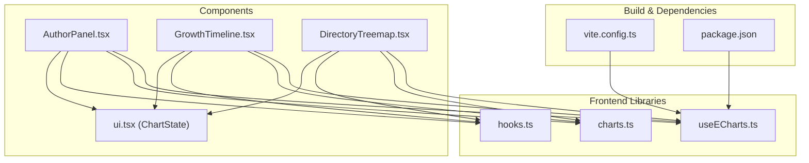
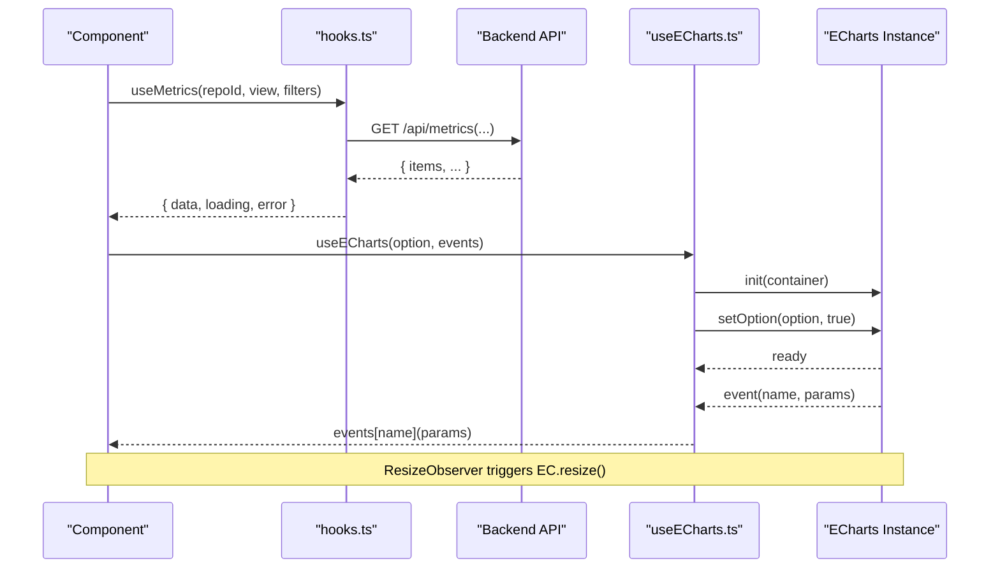
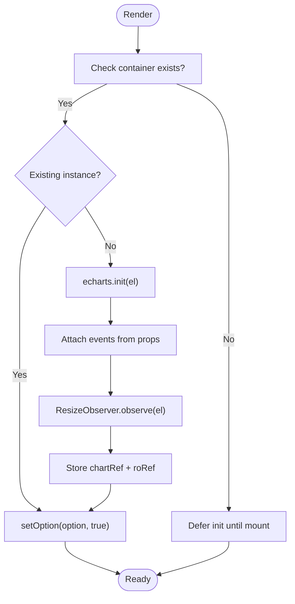
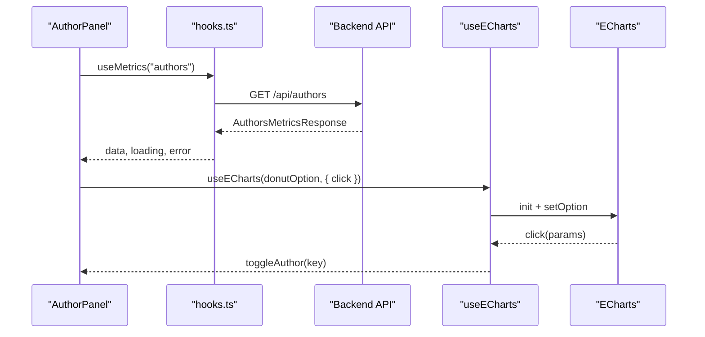
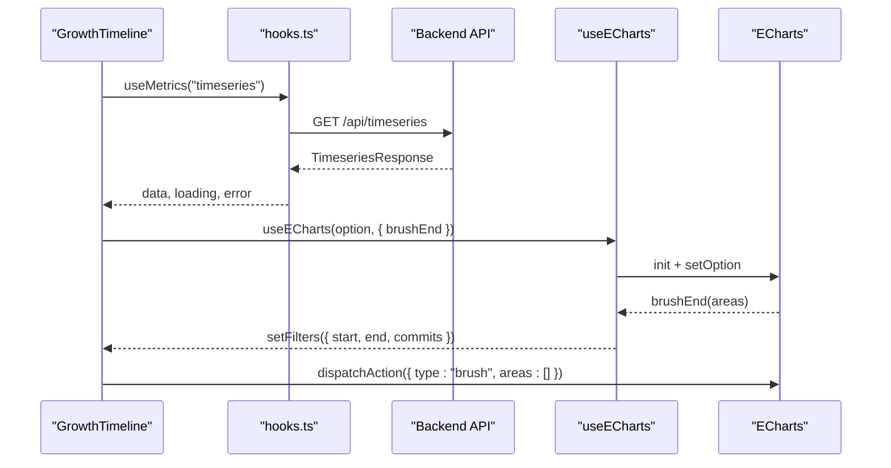
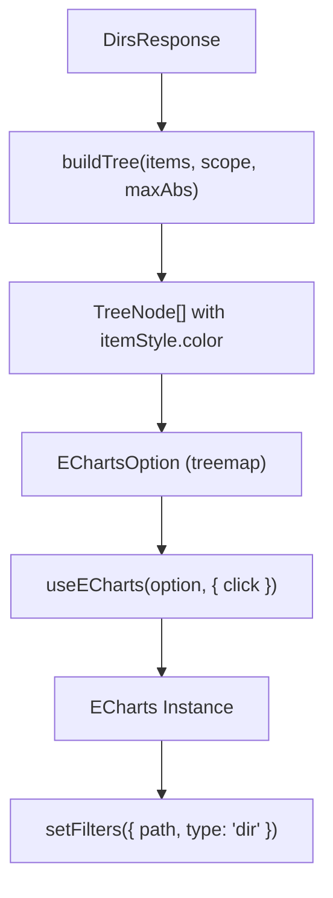
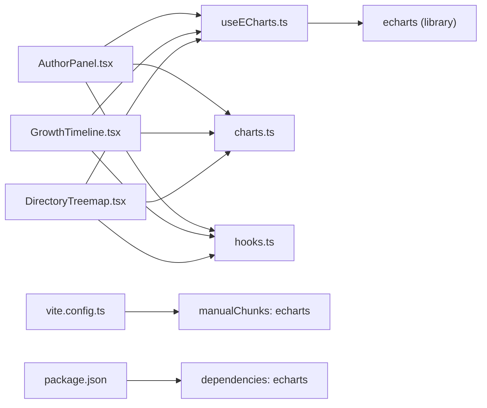

# ECharts Integration

<cite>
**Referenced Files in This Document**
- [useECharts.ts](file://frontend/src/lib/useECharts.ts)
- [charts.ts](file://frontend/src/lib/charts.ts)
- [AuthorPanel.tsx](file://frontend/src/components/AuthorPanel.tsx)
- [GrowthTimeline.tsx](file://frontend/src/components/GrowthTimeline.tsx)
- [DirectoryTreemap.tsx](file://frontend/src/components/DirectoryTreemap.tsx)
- [hooks.ts](file://frontend/src/lib/hooks.ts)
- [ui.tsx](file://frontend/src/components/ui.tsx)
- [vite.config.ts](file://frontend/vite.config.ts)
- [package.json](file://frontend/package.json)
</cite>

## Table of Contents
1. [Introduction](#introduction)
2. [Project Structure](#project-structure)
3. [Core Components](#core-components)
4. [Architecture Overview](#architecture-overview)
5. [Detailed Component Analysis](#detailed-component-analysis)
6. [Dependency Analysis](#dependency-analysis)
7. [Performance Considerations](#performance-considerations)
8. [Troubleshooting Guide](#troubleshooting-guide)
9. [Conclusion](#conclusion)
10. [Appendices](#appendices)

## Introduction
This document explains the ECharts integration layer used across the frontend. It focuses on:
- The `useECharts` custom hook that manages chart lifecycle, initialization, data updates, cleanup, and event handling.
- The `charts.ts` utility module that provides shared palette, axis, tooltip defaults, and a diverging color helper.
- How components consume these primitives to render charts with responsive resizing, consistent styling, and robust performance.
- Patterns for extending existing configurations and creating new chart types.

The goal is to make the integration approach clear for both newcomers and experienced developers who need to extend or maintain the visualization layer.

## Project Structure
The ECharts integration lives primarily under `frontend/src/lib`, while charting components live under `frontend/src/components`. Key files:
- `lib/useECharts.ts`: React binding for ECharts with lazy initialization, resize observation, option diffing, and event wiring.
- `lib/charts.ts`: Shared palette, base axis and tooltip configuration, and a diverging color function.
- `components/AuthorPanel.tsx`, `GrowthTimeline.tsx`, `DirectoryTreemap.tsx`: Example consumers using `useECharts` and `charts.ts`.
- `lib/hooks.ts`: Data-fetching hooks that feed chart data into components.
- `components/ui.tsx`: `ChartState` wrapper that keeps the chart canvas mounted during loading/error states.
- `vite.config.ts`: Bundling configuration that splits ECharts into its own chunk.
- `package.json`: Declares the ECharts dependency.

**Diagram sources**
- [useECharts.ts:1-55](file://frontend/src/lib/useECharts.ts#L1-L55)
- [charts.ts:1-47](file://frontend/src/lib/charts.ts#L1-L47)
- [AuthorPanel.tsx:1-199](file://frontend/src/components/AuthorPanel.tsx#L1-L199)
- [GrowthTimeline.tsx:1-174](file://frontend/src/components/GrowthTimeline.tsx#L1-L174)
- [DirectoryTreemap.tsx:1-198](file://frontend/src/components/DirectoryTreemap.tsx#L1-L198)
- [hooks.ts:1-142](file://frontend/src/lib/hooks.ts#L1-L142)
- [ui.tsx:36-64](file://frontend/src/components/ui.tsx#L36-L64)
- [vite.config.ts:1-26](file://frontend/vite.config.ts#L1-L26)
- [package.json:1-24](file://frontend/package.json#L1-L24)

**Section sources**
- [useECharts.ts:1-55](file://frontend/src/lib/useECharts.ts#L1-L55)
- [charts.ts:1-47](file://frontend/src/lib/charts.ts#L1-L47)
- [AuthorPanel.tsx:1-199](file://frontend/src/components/AuthorPanel.tsx#L1-L199)
- [GrowthTimeline.tsx:1-174](file://frontend/src/components/GrowthTimeline.tsx#L1-L174)
- [DirectoryTreemap.tsx:1-198](file://frontend/src/components/DirectoryTreemap.tsx#L1-L198)
- [hooks.ts:1-142](file://frontend/src/lib/hooks.ts#L1-L142)
- [ui.tsx:36-64](file://frontend/src/components/ui.tsx#L36-L64)
- [vite.config.ts:1-26](file://frontend/vite.config.ts#L1-L26)
- [package.json:1-24](file://frontend/package.json#L1-L24)

## Core Components
This section summarizes the core building blocks of the ECharts integration.

### useECharts Hook
Responsibilities:
- Lazy initialization: creates an ECharts instance only when the container element exists.
- Container re-mount safety: detects if the DOM node changed and disposes stale instances before re-initializing.
- Event wiring: attaches provided events to the chart instance via a ref so handlers can be updated without re-binding.
- Responsive resizing: uses ResizeObserver to call chart.resize() whenever the container size changes.
- Option diffing: calls setOption with incremental update enabled to avoid full re-renders.
- Cleanup: disconnects observers and disposes the chart instance on unmount.

Return values:
- `elRef`: DOM reference for the chart container.
- `chartRef`: Reference to the underlying ECharts instance, allowing direct actions like dispatching brush clears.

Key behaviors:
- If the container is not yet available, initialization is deferred until it mounts.
- If the container is replaced by React (e.g., conditional rendering), the old instance is disposed and a new one is created.
- Events are attached once per instance; handler updates are reflected through a ref.

**Section sources**
- [useECharts.ts:1-55](file://frontend/src/lib/useECharts.ts#L1-L55)

### charts Utility Module
Responsibilities:
- Centralized design tokens: colors for added/removed/growth/churn, grid lines, axes, text, tooltips, and series palette.
- Base axis configuration: reusable axis line, tick, label, and split-line styles.
- Base tooltip configuration: background, border, text style, and extra CSS for shadows and rounded corners.
- Diverging color helper: maps a numeric value to a red-to-green gradient centered at neutral gray, useful for growth indicators.

Usage patterns:
- Spread `axisBase` into axis options to keep visual consistency.
- Spread `tooltipBase` into tooltip options to standardize appearance.
- Use `divergingColor(value, maxAbs)` to compute cell or series colors based on signed metrics.

**Section sources**
- [charts.ts:1-47](file://frontend/src/lib/charts.ts#L1-L47)

### Chart State Wrapper
Responsibilities:
- Provides a consistent overlay for loading, error, and empty states.
- Keeps the chart children mounted underneath the overlay so the ECharts canvas is never detached. Detaching and re-attaching a chart is costly and sometimes unsupported; keeping it mounted avoids re-initialization overhead.

Integration points:
- Components wrap their chart containers inside `ChartState` and pass `loading`, `error`, and `empty` flags.

**Section sources**
- [ui.tsx:36-64](file://frontend/src/components/ui.tsx#L36-L64)

## Architecture Overview
The integration follows a layered pattern:
- Data layer: `hooks.ts` fetches metrics and exposes `data`, `loading`, and `error`.
- Presentation layer: Components compute ECharts options from data and filters.
- Binding layer: `useECharts` initializes and updates the chart, handles resize and events.
- Styling layer: `charts.ts` provides shared visual defaults.

**Diagram sources**
- [hooks.ts:51-99](file://frontend/src/lib/hooks.ts#L51-L99)
- [useECharts.ts:16-41](file://frontend/src/lib/useECharts.ts#L16-L41)
- [AuthorPanel.tsx:156-168](file://frontend/src/components/AuthorPanel.tsx#L156-L168)
- [GrowthTimeline.tsx:118-135](file://frontend/src/components/GrowthTimeline.tsx#L118-L135)

## Detailed Component Analysis

### useECharts Lifecycle Flow
Initialization and update flow:
1. On first render, `ensure()` checks whether the container exists.
2. If no instance exists, it initializes ECharts, wires events, sets up ResizeObserver, and stores the instance.
3. A `useEffect` runs when `option` changes, calling `setOption(option, true)` for incremental updates.
4. On unmount, the effect cleanup disconnects the observer and disposes the chart.

Container re-mount safety:
- If the DOM node bound to the chart changes (e.g., due to conditional rendering), the old instance is disposed and a new one is created.

Event handling:
- Events passed to the hook are attached once per instance.
- Handler functions are stored in a ref so they can be updated without re-binding.

Cleanup:
- Disconnects ResizeObserver.
- Disposes the ECharts instance.

**Diagram sources**
- [useECharts.ts:16-41](file://frontend/src/lib/useECharts.ts#L16-L41)

**Section sources**
- [useECharts.ts:16-51](file://frontend/src/lib/useECharts.ts#L16-L51)

### AuthorPanel: Donut and Bar Charts
Behavior:
- Fetches author metrics and computes two datasets: top authors for a donut chart and top modifiers for a horizontal bar chart.
- Uses `C.series` and `tooltipBase` from `charts.ts` for consistent styling.
- Wires click events to toggle authors in the global filter state.
- Wraps charts in `ChartState` to avoid detaching the canvas during loading/error states.

Data flow:
- `useMetrics` returns `AuthorsMetricsResponse`.
- Options are memoized to avoid unnecessary re-renders.
- Click handlers extract item keys and update filters.

**Diagram sources**
- [AuthorPanel.tsx:13-168](file://frontend/src/components/AuthorPanel.tsx#L13-L168)
- [hooks.ts:51-99](file://frontend/src/lib/hooks.ts#L51-L99)

**Section sources**
- [AuthorPanel.tsx:13-168](file://frontend/src/components/AuthorPanel.tsx#L13-L168)
- [charts.ts:3-33](file://frontend/src/lib/charts.ts#L3-L33)
- [ui.tsx:36-64](file://frontend/src/components/ui.tsx#L36-L64)

### GrowthTimeline: Brushed Time Range
Behavior:
- Renders a timeseries chart with added, removed, and growth lines.
- Uses toolbox brush to select a time range; the `brushEnd` event updates the global filter’s start/end dates.
- Exposes a “Clear range” button that resets filters and clears the brush area via `dispatchAction`.

Data flow:
- `useMetrics` returns `TimeseriesResponse`.
- Options include legend, tooltip, toolbox, brush, axes, and series.
- `chartRef` is used to programmatically clear the brush after updating filters.

**Diagram sources**
- [GrowthTimeline.tsx:14-135](file://frontend/src/components/GrowthTimeline.tsx#L14-L135)
- [hooks.ts:51-99](file://frontend/src/lib/hooks.ts#L51-L99)

**Section sources**
- [GrowthTimeline.tsx:14-135](file://frontend/src/components/GrowthTimeline.tsx#L14-L135)
- [charts.ts:20-33](file://frontend/src/lib/charts.ts#L20-L33)

### DirectoryTreemap: Tree Visualization
Behavior:
- Builds a hierarchical tree from directory rows, coloring cells by growth using `divergingColor`.
- Supports switching between treemap and tree views.
- Clicking a cell scopes metrics to that directory path.

Data flow:
- `useMetrics` returns `DirsResponse`.
- `buildTree` constructs nodes with computed styles.
- `useECharts` wires click events to update filters.

**Diagram sources**
- [DirectoryTreemap.tsx:26-123](file://frontend/src/components/DirectoryTreemap.tsx#L26-L123)
- [charts.ts:35-46](file://frontend/src/lib/charts.ts#L35-L46)

**Section sources**
- [DirectoryTreemap.tsx:26-123](file://frontend/src/components/DirectoryTreemap.tsx#L26-L123)
- [charts.ts:35-46](file://frontend/src/lib/charts.ts#L35-L46)

## Dependency Analysis
High-level dependencies:
- Components depend on `useECharts` for chart lifecycle and `charts.ts` for styling.
- Components depend on `hooks.ts` for data fetching.
- `useECharts` depends on the ECharts library.
- Vite config splits ECharts into a separate chunk to improve load performance.
- Package manifest declares ECharts as a runtime dependency.

**Diagram sources**
- [AuthorPanel.tsx:1-199](file://frontend/src/components/AuthorPanel.tsx#L1-L199)
- [GrowthTimeline.tsx:1-174](file://frontend/src/components/GrowthTimeline.tsx#L1-L174)
- [DirectoryTreemap.tsx:1-198](file://frontend/src/components/DirectoryTreemap.tsx#L1-L198)
- [useECharts.ts:1-55](file://frontend/src/lib/useECharts.ts#L1-L55)
- [charts.ts:1-47](file://frontend/src/lib/charts.ts#L1-L47)
- [hooks.ts:1-142](file://frontend/src/lib/hooks.ts#L1-L142)
- [vite.config.ts:15-25](file://frontend/vite.config.ts#L15-L25)
- [package.json:11-15](file://frontend/package.json#L11-L15)

**Section sources**
- [vite.config.ts:15-25](file://frontend/vite.config.ts#L15-L25)
- [package.json:11-15](file://frontend/package.json#L11-L15)

## Performance Considerations
- Incremental option updates: `useECharts` calls `setOption(option, true)` to apply diffs rather than full re-renders.
- Resize optimization: `ResizeObserver` triggers `chart.resize()` only when the container size changes.
- Avoiding detach/re-attach: `ChartState` keeps the chart container mounted under overlays, preventing expensive re-initialization.
- Memoization: Components memoize options and derived datasets to minimize recomputation.
- Debounced data fetching: `useMetrics` debounces filter changes to reduce network churn and UI flicker.
- Chunk splitting: Vite isolates ECharts into a separate chunk to improve initial load time.

Recommendations:
- Keep options stable by memoizing them with relevant dependencies.
- Prefer incremental data updates within series rather than replacing entire series arrays when possible.
- Limit heavy computations in render paths; precompute derived data with `useMemo`.
- Use `animation: false` for large datasets where interactivity is more important than animation effects.

[No sources needed since this section provides general guidance]

## Troubleshooting Guide
Common issues and resolutions:
- Chart not visible initially: Ensure the container element exists before initialization. `useECharts` defers init until the ref is present.
- Blank chart after navigation or conditional rendering: The hook disposes and reinitializes when the container changes; verify that the container remains mounted.
- Events not firing: Confirm that event names match ECharts event names and that handlers are provided to `useECharts`. Handlers are attached once per instance and updated via ref.
- Stale brush selection: After updating filters, call `dispatchAction({ type: "brush", areas: [] })` to clear the brush visually.
- Memory leaks: Ensure components unmount properly; `useECharts` disconnects observers and disposes instances on cleanup.

Operational tips:
- Wrap charts with `ChartState` to prevent canvas detachment during loading/error states.
- Use `chartRef.current?.dispatchAction(...)` to programmatically control chart features like brush or zoom.
- Validate event payload shapes before accessing properties to avoid runtime errors.

**Section sources**
- [useECharts.ts:16-51](file://frontend/src/lib/useECharts.ts#L16-L51)
- [ui.tsx:36-64](file://frontend/src/components/ui.tsx#L36-L64)
- [GrowthTimeline.tsx:118-143](file://frontend/src/components/GrowthTimeline.tsx#L118-L143)

## Conclusion
The ECharts integration layer provides a clean, performant, and extensible foundation for charting in the application:
- `useECharts` abstracts lifecycle concerns, ensuring safe initialization, responsive resizing, and proper cleanup.
- `charts.ts` centralizes visual design tokens and helpers, promoting consistency across charts.
- Components follow predictable patterns: fetch data with `hooks.ts`, compute options, bind events, and render via `useECharts`.
- The architecture supports responsive design, robust event handling, and performance optimizations suitable for interactive dashboards.

Extending the system is straightforward:
- Add new chart types by composing options with `charts.ts` utilities and wiring events through `useECharts`.
- Reuse base axis and tooltip configurations to maintain visual consistency.
- Leverage `chartRef` for programmatic interactions such as clearing brushes or triggering actions.

[No sources needed since this section summarizes without analyzing specific files]

## Appendices

### Extending Existing Configurations
Patterns:
- Spread `axisBase` into axis options to inherit consistent styling.
- Spread `tooltipBase` into tooltip options to standardize appearance.
- Use `C.series` for series colors and `C.added`, `C.removed`, `C.growth`, `C.churn` for semantic colors.
- Apply `divergingColor(value, maxAbs)` for signed metrics like growth.

Example patterns:
- Create a new line chart by combining `axisBase`, `tooltipBase`, and series definitions.
- Customize legends and toolbars while inheriting base styles.

**Section sources**
- [charts.ts:3-33](file://frontend/src/lib/charts.ts#L3-L33)
- [charts.ts:35-46](file://frontend/src/lib/charts.ts#L35-L46)

### Creating New Chart Types
Steps:
1. Fetch data using `useMetrics` or another appropriate hook.
2. Compute derived datasets and memoize options.
3. Call `useECharts(option, events)` and attach the returned `elRef` to a container div.
4. Optionally access `chartRef` for programmatic actions.
5. Wrap the chart in `ChartState` for consistent loading/error/empty behavior.

Best practices:
- Keep options stable and memoized.
- Use incremental updates via `setOption(option, true)`.
- Handle events defensively by validating payload shapes.
- Avoid animating large datasets; disable animations for performance.

**Section sources**
- [useECharts.ts:9-53](file://frontend/src/lib/useECharts.ts#L9-L53)
- [hooks.ts:51-99](file://frontend/src/lib/hooks.ts#L51-L99)
- [ui.tsx:36-64](file://frontend/src/components/ui.tsx#L36-L64)