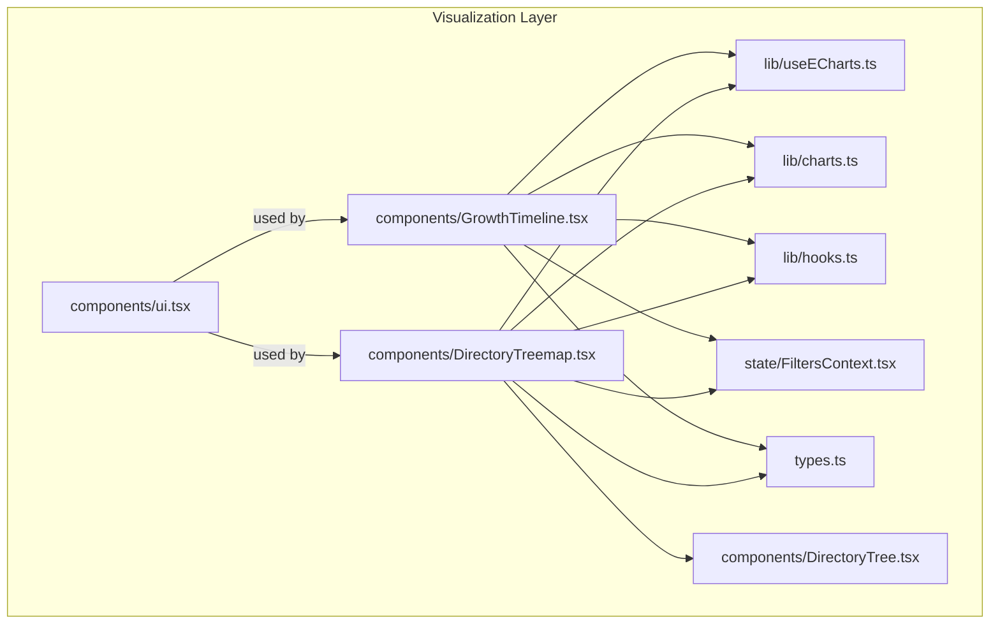
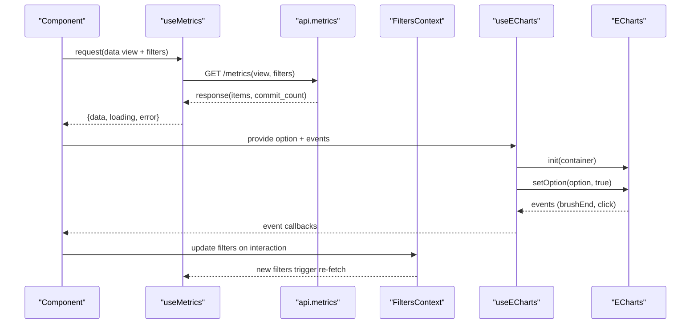
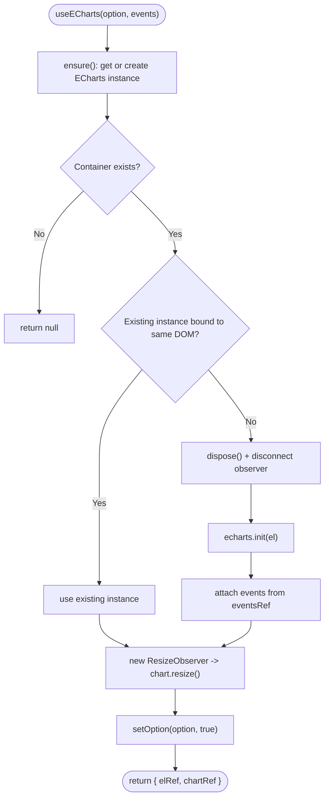
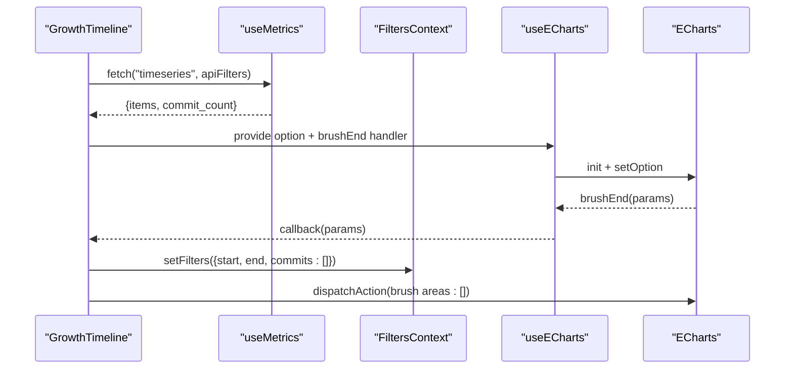
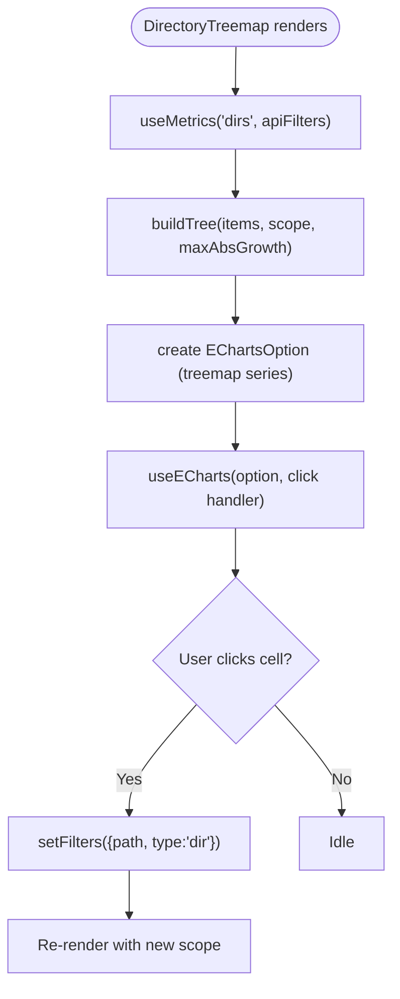
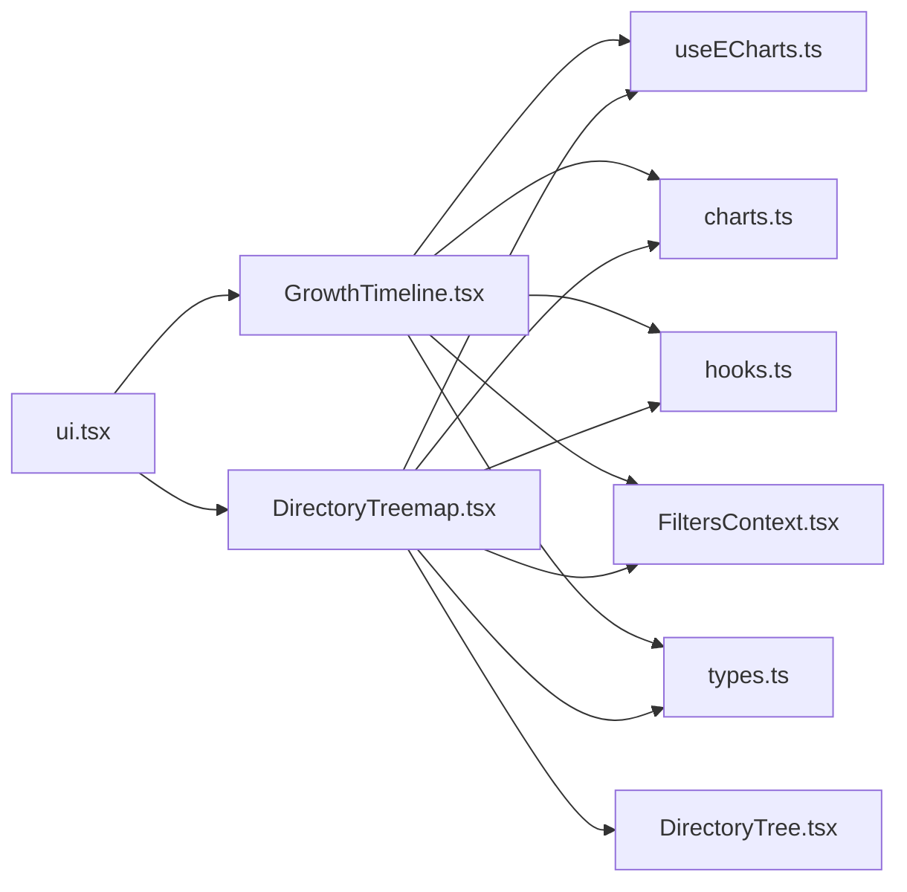

# Visualization Layer

<cite>
**Referenced Files in This Document **
- [useECharts.ts](file://frontend/src/lib/useECharts.ts)
- [charts.ts](file://frontend/src/lib/charts.ts)
- [GrowthTimeline.tsx](file://frontend/src/components/GrowthTimeline.tsx)
- [DirectoryTreemap.tsx](file://frontend/src/components/DirectoryTreemap.tsx)
- [DirectoryTree.tsx](file://frontend/src/components/DirectoryTree.tsx)
- [ui.tsx](file://frontend/src/components/ui.tsx)
- [hooks.ts](file://frontend/src/lib/hooks.ts)
- [FiltersContext.tsx](file://frontend/src/state/FiltersContext.tsx)
- [types.ts](file://frontend/src/types.ts)
</cite>

## Table of Contents
1. [Introduction](#introduction)
2. [Project Structure](#project-structure)
3. [Core Components](#core-components)
4. [Architecture Overview](#architecture-overview)
5. [Detailed Component Analysis](#detailed-component-analysis)
6. [Dependency Analysis](#dependency-analysis)
7. [Performance Considerations](#performance-considerations)
8. [Troubleshooting Guide](#troubleshooting-guide)
9. [Guidelines for Adding New Chart Types](#guidelines-for-adding-new-chart-types)
10. [Conclusion](#conclusion)

## Introduction
This document explains the ECharts-based visualization layer used by the frontend dashboard. It covers chart configuration patterns, responsive behavior, interactive features, and the lifecycle management provided by the `useECharts` hook. It also documents the shared chart utilities, data transformation helpers, and two complex visualizations: GrowthTimeline (timeseries with brush-driven time filtering) and DirectoryTreemap (directory hierarchy with size-by-churn and color-by-growth). Finally, it provides guidelines for adding new chart types and optimizing rendering performance.

## Project Structure
The visualization layer lives under `frontend/src`. The most relevant parts are:
- Library utilities for ECharts binding and shared styling/data helpers
- React components that render charts and handle user interactions
- Shared state context for filters and API hooks for metrics fetching
- TypeScript types describing API responses and filter contracts

**Diagram sources**
- [GrowthTimeline.tsx:1-174](file://frontend/src/components/GrowthTimeline.tsx#L1-L174)
- [DirectoryTreemap.tsx:1-198](file://frontend/src/components/DirectoryTreemap.tsx#L1-L198)
- [DirectoryTree.tsx:1-55](file://frontend/src/components/DirectoryTree.tsx#L1-L55)
- [ui.tsx:1-65](file://frontend/src/components/ui.tsx#L1-L65)
- [useECharts.ts:1-55](file://frontend/src/lib/useECharts.ts#L1-L55)
- [charts.ts:1-47](file://frontend/src/lib/charts.ts#L1-L47)
- [hooks.ts:1-142](file://frontend/src/lib/hooks.ts#L1-L142)
- [FiltersContext.tsx:1-119](file://frontend/src/state/FiltersContext.tsx#L1-L119)
- [types.ts:1-172](file://frontend/src/types.ts#L1-L172)

**Section sources**
- [GrowthTimeline.tsx:1-174](file://frontend/src/components/GrowthTimeline.tsx#L1-L174)
- [DirectoryTreemap.tsx:1-198](file://frontend/src/components/DirectoryTreemap.tsx#L1-L198)
- [useECharts.ts:1-55](file://frontend/src/lib/useECharts.ts#L1-L55)
- [charts.ts:1-47](file://frontend/src/lib/charts.ts#L1-L47)
- [hooks.ts:1-142](file://frontend/src/lib/hooks.ts#L1-L142)
- [FiltersContext.tsx:1-119](file://frontend/src/state/FiltersContext.tsx#L1-L119)
- [types.ts:1-172](file://frontend/src/types.ts#L1-L172)

## Core Components
- useECharts hook: Provides lazy initialization, resize observation, event binding, and cleanup for ECharts instances.
- charts utility: Centralizes palette, axis defaults, tooltip defaults, and a diverging color helper for growth values.
- GrowthTimeline component: Renders a timeseries line chart with added, removed, growth, and churn; supports brushing to set a time range filter.
- DirectoryTreemap component: Renders a treemap where area represents churn and color encodes growth; clicking scopes metrics to a directory. Also offers a tree view alternative.
- ui primitives: Shared presentational components including ChartState, which keeps the chart DOM mounted while overlays change.
- Data hooks and filters: useMetrics fetches metric data with debounced filters; FiltersContext manages URL-synced filters and translates them into backend-compatible payloads.

**Section sources**
- [useECharts.ts:1-55](file://frontend/src/lib/useECharts.ts#L1-L55)
- [charts.ts:1-47](file://frontend/src/lib/charts.ts#L1-L47)
- [GrowthTimeline.tsx:1-174](file://frontend/src/components/GrowthTimeline.tsx#L1-L174)
- [DirectoryTreemap.tsx:1-198](file://frontend/src/components/DirectoryTreemap.tsx#L1-L198)
- [ui.tsx:1-65](file://frontend/src/components/ui.tsx#L1-L65)
- [hooks.ts:51-99](file://frontend/src/lib/hooks.ts#L51-L99)
- [FiltersContext.tsx:1-119](file://frontend/src/state/FiltersContext.tsx#L1-L119)

## Architecture Overview
The visualization layer follows a clear separation of concerns:
- Components declare ECharts options using shared styles and transform data from API responses.
- useECharts owns the ECharts instance lifecycle and binds events.
- useMetrics handles data fetching with debouncing and stale-data preservation.
- FiltersContext centralizes filter state and converts UI filters into backend query parameters.

**Diagram sources**
- [GrowthTimeline.tsx:118-135](file://frontend/src/components/GrowthTimeline.tsx#L118-L135)
- [DirectoryTreemap.tsx:116-123](file://frontend/src/components/DirectoryTreemap.tsx#L116-L123)
- [hooks.ts:51-99](file://frontend/src/lib/hooks.ts#L51-L99)
- [useECharts.ts:9-53](file://frontend/src/lib/useECharts.ts#L9-L53)
- [FiltersContext.tsx:93-104](file://frontend/src/state/FiltersContext.tsx#L93-L104)

## Detailed Component Analysis

### useECharts Hook
Responsibilities:
- Lazy initialization when the container mounts late.
- Resize observation via ResizeObserver to keep charts responsive.
- Event registration through a ref so updates do not rebind handlers unnecessarily.
- Cleanup on unmount and safe disposal when the container is replaced.

Key behaviors:
- If the container changes due to React remounting, it disposes the old instance and reinitializes.
- Events passed as an object are attached once per instance and read from a ref to avoid re-binding on every render.
- Returns refs for the DOM element and the ECharts instance, enabling imperative actions like dispatching brush clearing.

**Diagram sources**
- [useECharts.ts:9-53](file://frontend/src/lib/useECharts.ts#L9-L53)

**Section sources**
- [useECharts.ts:1-55](file://frontend/src/lib/useECharts.ts#L1-L55)

### charts Utility
Provides:
- A consistent color palette for added, removed, growth, churn, grid, axes, text, tooltips, and series colors.
- Shared axis and tooltip base configurations for consistent look-and-feel across charts.
- A divergingColor function that maps a numeric growth value to a red-to-grey-to-green color scale, normalized by max absolute growth.

Usage patterns:
- Spread axisBase and tooltipBase into chart options to standardize appearance.
- Compute maxAbsGrowth from dataset items and pass it to divergingColor for treemap cell coloring.

**Section sources**
- [charts.ts:1-47](file://frontend/src/lib/charts.ts#L1-L47)

### GrowthTimeline Component
Purpose:
- Visualize time-series metrics (added, removed, growth) per bucket and allow users to select a time range via brush selection.

Data flow:
- Fetches timeseries data using useMetrics with repoId, view "timeseries", and apiFilters derived from FiltersContext.
- Computes buckets and series arrays from the response items.
- Builds an ECharts option with multiple line series, custom tooltip formatter, toolbox brush, and dataZoom.

Interactions:
- BrushEnd event computes index bounds from the brushed coordinate range, maps bucket indices to start/end dates, and updates FiltersContext.
- Clears the brush visually after updating filters to avoid persistent painted areas.
- Provides a Clear Range button to reset filters and remove the brush.

Responsive design:
- Uses useECharts, which observes container size changes and resizes the chart accordingly.
- Disables animations for smoother interactions during frequent updates.

Customization options exposed:
- Granularity affects label formatting and bucket interpretation.
- Series colors and styles come from the shared palette.
- Tooltip formatter can be extended to include additional fields from TimeseriesPoint.

**Diagram sources**
- [GrowthTimeline.tsx:15-20](file://frontend/src/components/GrowthTimeline.tsx#L15-L20)
- [GrowthTimeline.tsx:25-116](file://frontend/src/components/GrowthTimeline.tsx#L25-L116)
- [GrowthTimeline.tsx:118-135](file://frontend/src/components/GrowthTimeline.tsx#L118-L135)
- [GrowthTimeline.tsx:139-143](file://frontend/src/components/GrowthTimeline.tsx#L139-L143)

**Section sources**
- [GrowthTimeline.tsx:1-174](file://frontend/src/components/GrowthTimeline.tsx#L1-L174)
- [hooks.ts:51-99](file://frontend/src/lib/hooks.ts#L51-L99)
- [types.ts:138-153](file://frontend/src/types.ts#L138-L153)

### DirectoryTreemap Component
Purpose:
- Render a treemap where each node’s area represents churn and its color reflects growth (red for negative, green for positive). Clicking a cell scopes all metrics to that directory.

Data transformation:
- Builds a hierarchical tree from flat DirRow items using buildTree, computing maxAbsGrowth for color normalization.
- Sorts children by value (churn) recursively for consistent layout.
- Maps each node to a TreeNode structure with itemStyle.color derived from divergingColor.

Chart configuration:
- Uses a single treemap series with full-width/height sizing, disabled roam, no default nodeClick, and minimal breadcrumb.
- Tooltip displays path, churn, added/removed, growth, and modifications.

Interactions:
- click event sets the current scope to the clicked directory path and type "dir".
- Offers a toggle between treemap and tree views; the tree view uses DirectoryTree component with identical scoping behavior.
- Provides an “Up” button to navigate to the parent directory.

Responsive design:
- Leverages useECharts for resize handling.
- ChartState overlay preserves the underlying chart DOM to avoid costly re-initialization.

**Diagram sources**
- [DirectoryTreemap.tsx:26-56](file://frontend/src/components/DirectoryTreemap.tsx#L26-L56)
- [DirectoryTreemap.tsx:76-114](file://frontend/src/components/DirectoryTreemap.tsx#L76-L114)
- [DirectoryTreemap.tsx:116-123](file://frontend/src/components/DirectoryTreemap.tsx#L116-L123)

**Section sources**
- [DirectoryTreemap.tsx:1-198](file://frontend/src/components/DirectoryTreemap.tsx#L1-L198)
- [DirectoryTree.tsx:1-55](file://frontend/src/components/DirectoryTree.tsx#L1-L55)
- [charts.ts:35-46](file://frontend/src/lib/charts.ts#L35-L46)
- [types.ts:113-121](file://frontend/src/types.ts#L113-L121)

### ui.tsx: ChartState
Purpose:
- Provide a consistent overlay pattern for loading, error, and empty states without detaching the chart DOM.
- Keeps the chart canvas mounted underneath overlays to avoid expensive re-initialization.

Behavior:
- Renders children first, then overlays error/loading/empty messages on top.
- Used by both GrowthTimeline and DirectoryTreemap to ensure stable chart instances.

**Section sources**
- [ui.tsx:36-64](file://frontend/src/components/ui.tsx#L36-L64)

### Data Hooks and Filters
- useMetrics: Debounces filter changes, maintains previous data until new data arrives, and exposes reload capability.
- FiltersContext: Parses and serializes URL query parameters, computes mode ("range" vs "manual"), and builds MetricsFilters for the backend.

These pieces ensure that chart interactions (brushing, clicking directories) translate into URL-synced filters, which in turn drive data refreshes.

**Section sources**
- [hooks.ts:51-99](file://frontend/src/lib/hooks.ts#L51-L99)
- [FiltersContext.tsx:24-55](file://frontend/src/state/FiltersContext.tsx#L24-L55)
- [FiltersContext.tsx:93-104](file://frontend/src/state/FiltersContext.tsx#L93-L104)

## Dependency Analysis
High-level dependencies among visualization components and utilities:

**Diagram sources**
- [GrowthTimeline.tsx:1-174](file://frontend/src/components/GrowthTimeline.tsx#L1-L174)
- [DirectoryTreemap.tsx:1-198](file://frontend/src/components/DirectoryTreemap.tsx#L1-L198)
- [useECharts.ts:1-55](file://frontend/src/lib/useECharts.ts#L1-L55)
- [charts.ts:1-47](file://frontend/src/lib/charts.ts#L1-L47)
- [hooks.ts:1-142](file://frontend/src/lib/hooks.ts#L1-L142)
- [FiltersContext.tsx:1-119](file://frontend/src/state/FiltersContext.tsx#L1-L119)
- [types.ts:1-172](file://frontend/src/types.ts#L1-L172)
- [DirectoryTree.tsx:1-55](file://frontend/src/components/DirectoryTree.tsx#L1-L55)

**Section sources**
- [GrowthTimeline.tsx:1-174](file://frontend/src/components/GrowthTimeline.tsx#L1-L174)
- [DirectoryTreemap.tsx:1-198](file://frontend/src/components/DirectoryTreemap.tsx#L1-L198)
- [useECharts.ts:1-55](file://frontend/src/lib/useECharts.ts#L1-L55)
- [charts.ts:1-47](file://frontend/src/lib/charts.ts#L1-L47)
- [hooks.ts:1-142](file://frontend/src/lib/hooks.ts#L1-L142)
- [FiltersContext.tsx:1-119](file://frontend/src/state/FiltersContext.tsx#L1-L119)
- [types.ts:1-172](file://frontend/src/types.ts#L1-L172)
- [DirectoryTree.tsx:1-55](file://frontend/src/components/DirectoryTree.tsx#L1-L55)

## Performance Considerations
- Disable animations for frequently updated charts to reduce reflow cost. Both GrowthTimeline and DirectoryTreemap set animation to false.
- Keep chart DOM mounted under overlays using ChartState to avoid expensive re-initialization on state changes.
- Debounce filter changes in useMetrics to prevent excessive network requests and chart updates.
- Use ResizeObserver in useECharts to efficiently respond to container size changes without manual window resize listeners.
- Avoid heavy computations inside render paths; precompute series data and tree structures with useMemo.
- Limit visible nodes in treemaps by setting visibleMin and controlling data volume via backend pagination if needed.

[No sources needed since this section provides general guidance]

## Troubleshooting Guide
Common issues and resolutions:
- Chart not resizing: Ensure the container has explicit dimensions and that useECharts is used; verify ResizeObserver is active.
- Brush does not update filters: Confirm brushEnd handler maps coordinate ranges to bucket indices correctly and calls setFilters with valid date strings.
- Treemap shows no data: Verify that the selected scope exists in the dataset and that buildTree returns a non-null root node.
- Stale data flashing: Rely on useMetrics’ stale-data preservation; avoid resetting data manually during transitions.
- Event handlers not firing: Ensure events are passed to useECharts and that the event names match ECharts event names (e.g., brushEnd, click).

**Section sources**
- [ui.tsx:36-64](file://frontend/src/components/ui.tsx#L36-L64)
- [GrowthTimeline.tsx:118-135](file://frontend/src/components/GrowthTimeline.tsx#L118-L135)
- [DirectoryTreemap.tsx:116-123](file://frontend/src/components/DirectoryTreemap.tsx#L116-L123)
- [hooks.ts:51-99](file://frontend/src/lib/hooks.ts#L51-L99)

## Guidelines for Adding New Chart Types
Steps to implement a new chart:
1. Define types: Add any new response or filter types to types.ts to reflect backend schemas.
2. Prepare data: Transform API responses into ECharts-friendly structures; reuse charts.ts utilities for consistent styling and colors.
3. Create component: Implement a React component that:
   - Reads filters from FiltersContext and passes apiFilters to useMetrics.
   - Builds an EChartsOption using shared axisBase and tooltipBase.
   - Calls useECharts with the option and desired event handlers.
   - Wraps the chart container in ChartState to manage loading/error/empty overlays.
4. Handle interactions: Map chart events to filter updates via setFilters; consider dispatchAction to clear visual selections when appropriate.
5. Make it responsive: Rely on useECharts for resize handling; ensure the container has CSS dimensions.
6. Optimize:
   - Disable animations for large datasets.
   - Precompute derived data with useMemo.
   - Debounce user inputs that affect filters.
   - Avoid unnecessary re-renders by memoizing options and event handlers.

Best practices:
- Keep chart options pure functions of props/data to leverage React’s memoization.
- Centralize shared styles and formatters in charts.ts and lib/format.ts.
- Use FiltersContext consistently so all charts share the same filter state and URL synchronization.
- Test edge cases: empty datasets, invalid ranges, and rapid filter changes.

[No sources needed since this section provides general guidance]

## Conclusion
The visualization layer combines a robust ECharts binding hook, shared styling utilities, and well-structured React components to deliver responsive, interactive dashboards. GrowthTimeline and DirectoryTreemap demonstrate effective data binding, event handling, and customization patterns. By following the outlined guidelines and performance recommendations, you can extend the system with new chart types while maintaining consistency, responsiveness, and efficiency.

[No sources needed since this section summarizes without analyzing specific files]