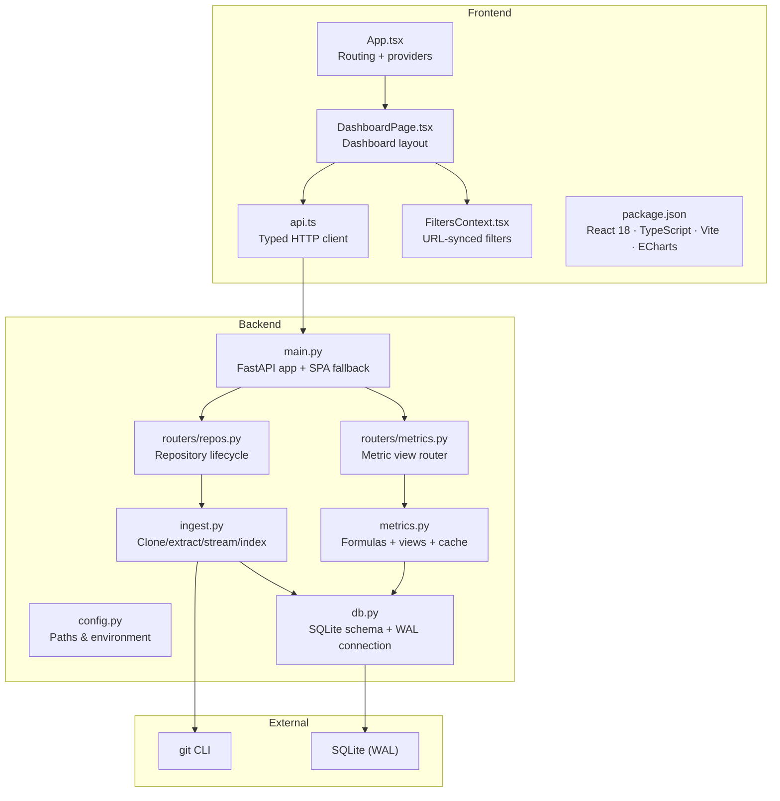
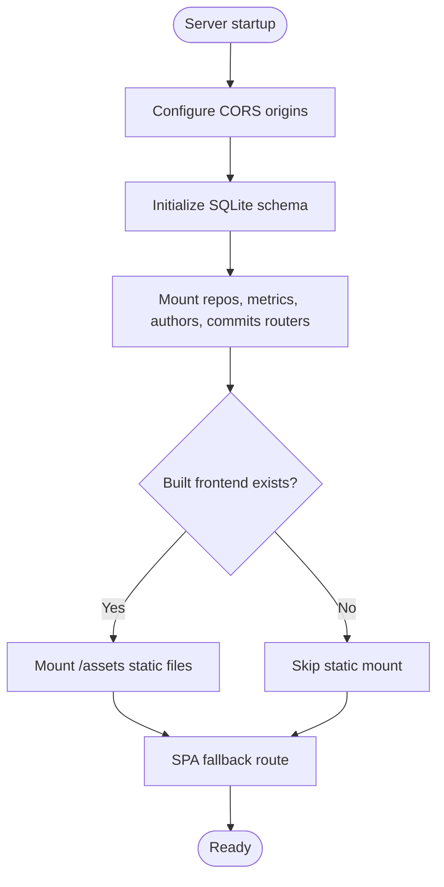
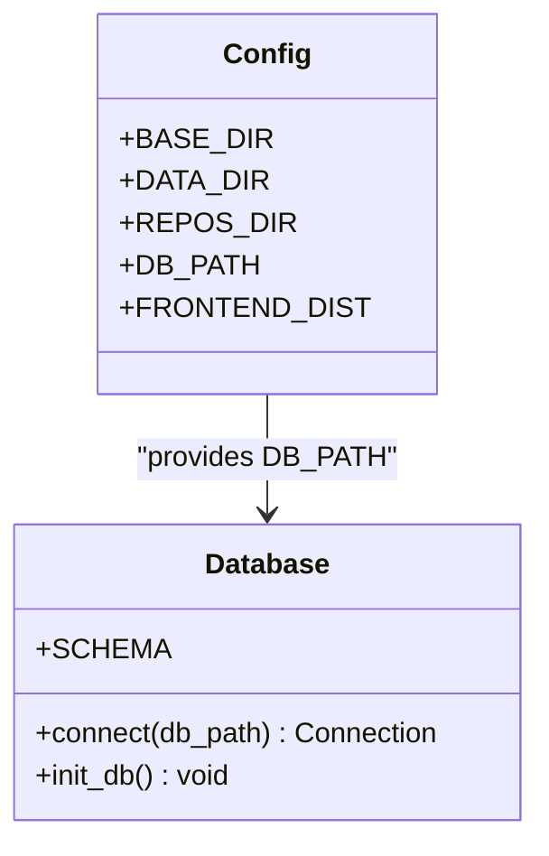
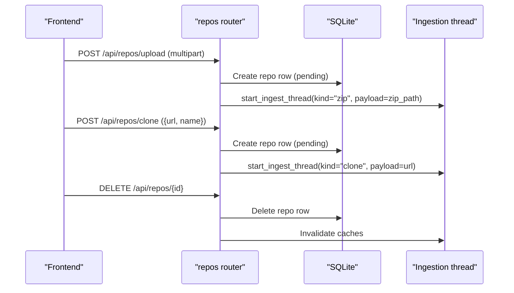
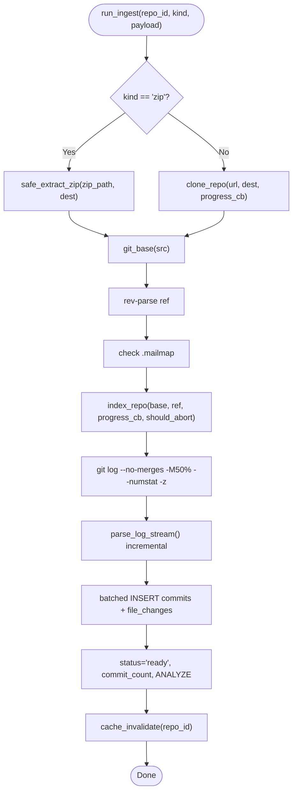
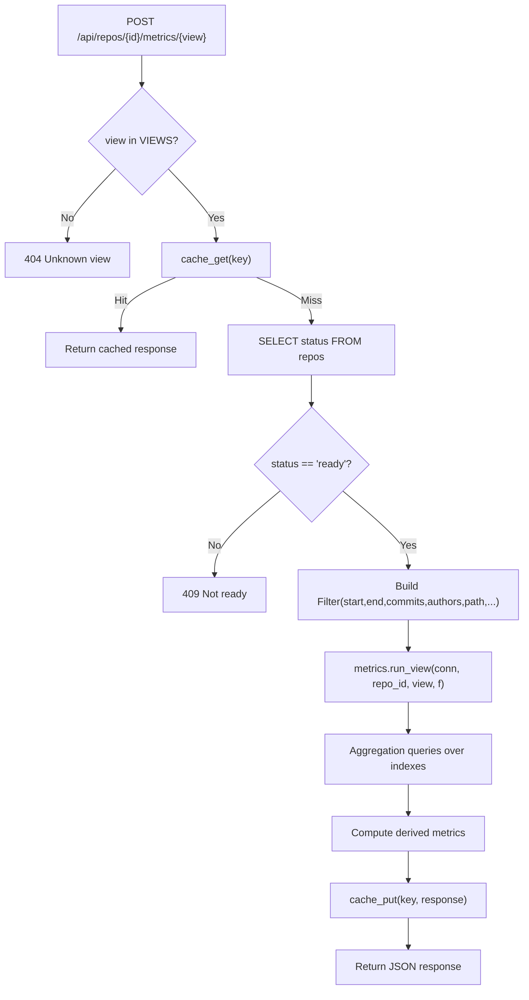
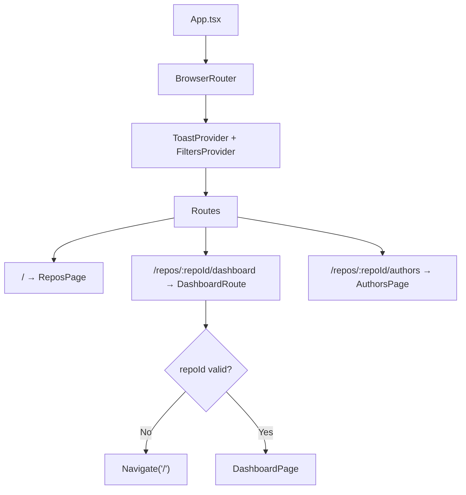
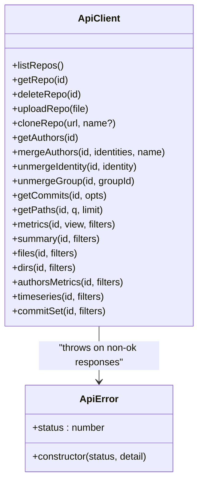
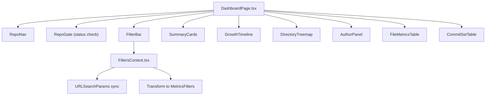
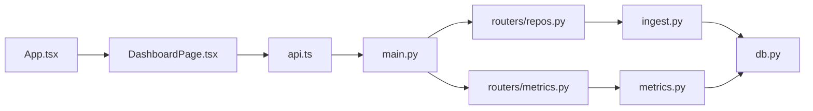

# System Architecture

<cite>
**Referenced Files in This Document**
- [README.md](file://README.md)
- [Makefile](file://Makefile)
- [backend/app/main.py](file://backend/app/main.py)
- [backend/app/config.py](file://backend/app/config.py)
- [backend/app/db.py](file://backend/app/db.py)
- [backend/app/ingest.py](file://backend/app/ingest.py)
- [backend/app/routers/repos.py](file://backend/app/routers/repos.py)
- [backend/app/routers/metrics.py](file://backend/app/routers/metrics.py)
- [backend/app/metrics.py](file://backend/app/metrics.py)
- [frontend/package.json](file://frontend/package.json)
- [frontend/src/App.tsx](file://frontend/src/App.tsx)
- [frontend/src/api.ts](file://frontend/src/api.ts)
- [frontend/src/pages/DashboardPage.tsx](file://frontend/src/pages/DashboardPage.tsx)
- [frontend/src/state/FiltersContext.tsx](file://frontend/src/state/FiltersContext.tsx)
</cite>

## Table of Contents
1. [Introduction](#introduction)
2. [Project Structure](#project-structure)
3. [Core Components](#core-components)
4. [Architecture Overview](#architecture-overview)
5. [Detailed Component Analysis](#detailed-component-analysis)
6. [Dependency Analysis](#dependency-analysis)
7. [Performance Considerations](#performance-considerations)
8. [Scalability and Deployment Topology](#scalability-and-deployment-topology)
9. [Troubleshooting Guide](#troubleshooting-guide)
10. [Conclusion](#conclusion)

## Introduction
RAT is a multi-repository web dashboard that turns git history into filterable metrics for files, directories, repositories, commit sets, and authors. The system separates the backend (Python 3.12 + FastAPI + SQLite with WAL mode) from the frontend (React 18 + TypeScript + Vite + ECharts). Repository ingestion streams `git log` output once per repository, parses it incrementally, and persists indexed data to an indexed SQLite database. Interactive queries then aggregate over those indexes, optionally using a short-lived response cache.

The high-level flow is:
- Frontend requests repository upload or clone.
- Backend starts background ingestion, streaming `git log` through a bounded parser into batched SQLite inserts.
- Once indexed, the frontend polls repository status and issues metric queries against the SQLite-backed API.
- Visualizations render summaries, timelines, treemaps, author panels, file tables, and commit-set tables.

**Section sources**
- [README.md:1-15](file://README.md#L1-L15)
- [README.md:168-194](file://README.md#L168-L194)

## Project Structure
RAT is organized by layer and feature:
- `backend/app`: FastAPI application, routers, ingestion, metrics, schema, configuration.
- `frontend/src`: React application, typed API client, routing, pages, components, shared state, and chart helpers.
- `scripts`: Metric verification tooling.
- `Makefile`: Unified entry points for install, development, build, run, test, and verification.



**Diagram sources**
- [frontend/src/App.tsx:1-38](file://frontend/src/App.tsx#L1-L38)
- [frontend/src/api.ts:1-127](file://frontend/src/api.ts#L1-L127)
- [frontend/src/pages/DashboardPage.tsx:1-95](file://frontend/src/pages/DashboardPage.tsx#L1-L95)
- [frontend/src/state/FiltersContext.tsx:1-119](file://frontend/src/state/FiltersContext.tsx#L1-L119)
- [frontend/package.json:1-25](file://frontend/package.json#L1-L25)
- [backend/app/main.py:1-49](file://backend/app/main.py#L1-L49)
- [backend/app/config.py:1-15](file://backend/app/config.py#L1-L15)
- [backend/app/db.py:1-87](file://backend/app/db.py#L1-L87)
- [backend/app/ingest.py:1-439](file://backend/app/ingest.py#L1-L439)
- [backend/app/routers/repos.py:1-114](file://backend/app/routers/repos.py#L1-L114)
- [backend/app/routers/metrics.py:1-41](file://backend/app/routers/metrics.py#L1-L41)
- [backend/app/metrics.py:1-435](file://backend/app/metrics.py#L1-L435)

**Section sources**
- [README.md:196-206](file://README.md#L196-L206)
- [Makefile:1-63](file://Makefile#L1-L63)

## Core Components
- Backend application server: FastAPI app, CORS middleware, static asset mounting, and SPA fallback.
- Configuration: runtime paths for data directory, repository storage, SQLite database, and frontend distribution.
- Database layer: schema definition, WAL-mode connection helper, and initialization.
- Ingestion pipeline: zip extraction, remote cloning, streamed parsing of `git log`, and batched indexing.
- Metrics engine: formula definitions, SQL-based views, and a small TTL cache.
- Frontend shell: React Router setup, global providers, and page routing.
- API client: typed fetch wrapper and endpoint methods.
- Dashboard UI: filter bar, summary cards, timeline, treemap, author panel, file table, and commit-set table.

Key responsibilities:
- `main.py` wires routers and serves the built frontend when available.
- `config.py` centralizes filesystem layout and environment overrides.
- `db.py` defines the relational model and tuned SQLite settings.
- `ingest.py` orchestrates acquisition and streaming index construction.
- `metrics.py` implements all aggregation logic and caching.
- `App.tsx` provides routing and context providers.
- `api.ts` encapsulates HTTP calls and error handling.
- `DashboardPage.tsx` composes the interactive dashboard.
- `FiltersContext.tsx` synchronizes filters with the URL query string.

**Section sources**
- [backend/app/main.py:1-49](file://backend/app/main.py#L1-L49)
- [backend/app/config.py:1-15](file://backend/app/config.py#L1-L15)
- [backend/app/db.py:1-87](file://backend/app/db.py#L1-L87)
- [backend/app/ingest.py:1-439](file://backend/app/ingest.py#L1-L439)
- [backend/app/metrics.py:1-435](file://backend/app/metrics.py#L1-L435)
- [frontend/src/App.tsx:1-38](file://frontend/src/App.tsx#L1-L38)
- [frontend/src/api.ts:1-127](file://frontend/src/api.ts#L1-L127)
- [frontend/src/pages/DashboardPage.tsx:1-95](file://frontend/src/pages/DashboardPage.tsx#L1-L95)
- [frontend/src/state/FiltersContext.tsx:1-119](file://frontend/src/state/FiltersContext.tsx#L1-L119)

## Architecture Overview
RAT follows a layered architecture:
- Presentation layer: React/TypeScript SPA rendered by Vite; communicates with the backend via REST-like JSON endpoints.
- API layer: FastAPI routers expose repository management and metric queries.
- Processing layer: Background ingestion uses one subprocess per repository to stream `git log`.
- Storage layer: SQLite with WAL mode stores commits and file changes, with indexes optimized for time ranges, paths, and primary keys.

```mermaid
sequenceDiagram
participant User as "User Browser"
participant FE as "Frontend App"
participant API as "FastAPI Server"
participant RepoRouter as "repos router"
participant Ing as "Ingestion Pipeline"
participant Git as "git CLI"
participant DB as "SQLite (WAL)"
participant MetricRouter as "metrics router"
participant Metrics as "Metrics Engine"
User->>FE : Upload zip or paste clone URL
FE->>API : POST /api/repos/upload or /api/repos/clone
API->>RepoRouter : Route request
RepoRouter->>DB : Insert repo row (pending)
RepoRouter->>Ing : start_ingest_thread(repo_id, kind, payload)
Ing->>Git : clone --mirror or extract zip
Ing->>Git : git log --no-merges -M50% --numstat -z
Git-->>Ing : NUL-delimited stream
Ing->>DB : Batch INSERT commits + file_changes
Ing->>DB : Update status = ready, commit_count
Note over Ing,DB : One subprocess per repository; bounded memory
User->>FE : Open dashboard
FE->>API : GET /api/repos/{id}
API->>DB : Read repo status
FE->>API : POST /api/repos/{id}/metrics/{view}
API->>MetricRouter : Route request
MetricRouter->>Metrics : run_view(conn, repo_id, view, filters)
Metrics->>DB : Aggregation queries over indexes
DB-->>Metrics : Result rows
Metrics-->>MetricRouter : View result
MetricRouter-->>FE : JSON response (cached when applicable)
```

**Diagram sources**
- [backend/app/routers/repos.py:43-94](file://backend/app/routers/repos.py#L43-L94)
- [backend/app/ingest.py:97-118](file://backend/app/ingest.py#L97-L118)
- [backend/app/ingest.py:280-350](file://backend/app/ingest.py#L280-L350)
- [backend/app/routers/metrics.py:13-41](file://backend/app/routers/metrics.py#L13-L41)
- [backend/app/metrics.py:399-400](file://backend/app/metrics.py#L399-L400)

**Section sources**
- [backend/app/main.py:13-27](file://backend/app/main.py#L13-L27)
- [backend/app/routers/repos.py:43-114](file://backend/app/routers/repos.py#L43-L114)
- [backend/app/routers/metrics.py:1-41](file://backend/app/routers/metrics.py#L1-L41)
- [backend/app/ingest.py:1-439](file://backend/app/ingest.py#L1-L439)

## Detailed Component Analysis

### Backend Application Server
The FastAPI application initializes CORS, creates the database, mounts routers, serves static assets when present, and provides an SPA fallback route that avoids capturing `/api/*`.



**Diagram sources**
- [backend/app/main.py:13-49](file://backend/app/main.py#L13-L49)

**Section sources**
- [backend/app/main.py:1-49](file://backend/app/main.py#L1-L49)

### Configuration and Storage Layer
Configuration centralizes base directory, data directory, repository storage path, SQLite database path, and frontend distribution path. The database layer defines the schema and provides a tuned connection with WAL mode, synchronous NORMAL, and foreign key enforcement.



**Diagram sources**
- [backend/app/config.py:1-15](file://backend/app/config.py#L1-L15)
- [backend/app/db.py:13-87](file://backend/app/db.py#L13-L87)

**Section sources**
- [backend/app/config.py:1-15](file://backend/app/config.py#L1-L15)
- [backend/app/db.py:1-87](file://backend/app/db.py#L1-L87)

### Repository Lifecycle Routers
Repository routers handle listing, uploading zips, cloning URLs, retrieving status, and deleting repositories. Uploads are validated, temporarily stored, and launched into background ingestion threads. Cloning validates URL schemes and triggers ingestion. Deletion removes database rows and on-disk repository data, invalidating caches.



**Diagram sources**
- [backend/app/routers/repos.py:43-114](file://backend/app/routers/repos.py#L43-L114)
- [backend/app/ingest.py:437-439](file://backend/app/ingest.py#L437-L439)

**Section sources**
- [backend/app/routers/repos.py:1-114](file://backend/app/routers/repos.py#L1-L114)

### Ingestion Pipeline
Ingestion supports two acquisition modes:
- Zip upload: safe extraction with traversal checks, locating the git repository root.
- Remote clone: full mirror clone with progress parsing.

Indexing streams `git log` output, parses NUL-delimited tokens incrementally, handles renames and binary files, and batches inserts into SQLite. Progress updates are persisted, and ingestion can be aborted if the repository row disappears.



**Diagram sources**
- [backend/app/ingest.py:362-429](file://backend/app/ingest.py#L362-L429)
- [backend/app/ingest.py:280-350](file://backend/app/ingest.py#L280-L350)
- [backend/app/ingest.py:97-118](file://backend/app/ingest.py#L97-L118)
- [backend/app/ingest.py:121-139](file://backend/app/ingest.py#L121-L139)

**Section sources**
- [backend/app/ingest.py:1-439](file://backend/app/ingest.py#L1-L439)

### Metrics Engine and Views
The metrics engine defines formulas for added, removed, growth, churn, modifications, modification frequency, churn rate, and ownership. It exposes multiple views:
- Summary: totals for the selected object scope.
- Files: per-file metrics within the scope.
- Dirs: recursive directory sums with per-commit de-duplication.
- Authors: per-author modifications, churn, and ownership.
- Timeseries: bucketed timeline by day, week, or month.
- Commits: paged commit-set rows with optional object filtering.

A small in-process cache stores responses keyed by `(repo_id, view, sorted_payload)` with a 30-second TTL and maximum size. Cache invalidation occurs after ingestion completes or a repository is deleted.



**Diagram sources**
- [backend/app/routers/metrics.py:13-41](file://backend/app/routers/metrics.py#L13-L41)
- [backend/app/metrics.py:43-65](file://backend/app/metrics.py#L43-L65)
- [backend/app/metrics.py:399-435](file://backend/app/metrics.py#L399-L435)

**Section sources**
- [backend/app/routers/metrics.py:1-41](file://backend/app/routers/metrics.py#L1-L41)
- [backend/app/metrics.py:1-435](file://backend/app/metrics.py#L1-L435)

### Frontend Shell and Routing
The React application configures routing, wraps pages with global providers, and navigates between repository list, dashboard, and author pages. The dashboard route validates the repository ID and provides filter context.



**Diagram sources**
- [frontend/src/App.tsx:1-38](file://frontend/src/App.tsx#L1-L38)

**Section sources**
- [frontend/src/App.tsx:1-38](file://frontend/src/App.tsx#L1-L38)

### Frontend API Client
The typed API client abstracts fetch calls, converts errors into a structured `ApiError`, and exposes methods for repository operations, author merges, commit/path search, and metric views. All paths are relative so both the Vite dev proxy and production single-port serving work unchanged.



**Diagram sources**
- [frontend/src/api.ts:17-44](file://frontend/src/api.ts#L17-L44)
- [frontend/src/api.ts:54-127](file://frontend/src/api.ts#L54-L127)

**Section sources**
- [frontend/src/api.ts:1-127](file://frontend/src/api.ts#L1-L127)

### Dashboard Page and Filter State
The dashboard composes the repository navigation, status gate, filter bar, summary cards, growth timeline, directory treemap, author panel, file metrics table, and commit-set table. Filter state is synchronized with the URL query string, supporting shareable/bookmarkable links. It translates user-facing date strings and granularity into backend-compatible UNIX timestamps and exclusive end boundaries.



**Diagram sources**
- [frontend/src/pages/DashboardPage.tsx:17-95](file://frontend/src/pages/DashboardPage.tsx#L17-L95)
- [frontend/src/state/FiltersContext.tsx:24-55](file://frontend/src/state/FiltersContext.tsx#L24-L55)
- [frontend/src/state/FiltersContext.tsx:93-104](file://frontend/src/state/FiltersContext.tsx#L93-L104)

**Section sources**
- [frontend/src/pages/DashboardPage.tsx:1-95](file://frontend/src/pages/DashboardPage.tsx#L1-L95)
- [frontend/src/state/FiltersContext.tsx:1-119](file://frontend/src/state/FiltersContext.tsx#L1-L119)

## Dependency Analysis
Component coupling and cohesion:
- `main.py` depends on routers and database initialization; it is the composition root for the FastAPI app.
- `routers/repos.py` depends on ingestion and metrics cache invalidation; it manages repository lifecycle.
- `routers/metrics.py` depends on the metrics engine and database; it validates views and applies caching.
- `ingest.py` depends on database connections and git CLI; it orchestrates acquisition and streaming indexing.
- `metrics.py` depends on author joins and database; it implements all aggregation logic.
- Frontend `App.tsx` depends on pages and providers; `DashboardPage.tsx` depends on components and filter context.
- `api.ts` depends on types and fetch; it is the sole HTTP boundary for the frontend.



**Diagram sources**
- [backend/app/main.py:13-27](file://backend/app/main.py#L13-L27)
- [backend/app/routers/repos.py:1-114](file://backend/app/routers/repos.py#L1-L114)
- [backend/app/routers/metrics.py:1-41](file://backend/app/routers/metrics.py#L1-L41)
- [backend/app/ingest.py:1-439](file://backend/app/ingest.py#L1-L439)
- [backend/app/metrics.py:1-435](file://backend/app/metrics.py#L1-L435)
- [frontend/src/App.tsx:1-38](file://frontend/src/App.tsx#L1-L38)
- [frontend/src/pages/DashboardPage.tsx:1-95](file://frontend/src/pages/DashboardPage.tsx#L1-L95)
- [frontend/src/api.ts:1-127](file://frontend/src/api.ts#L1-L127)

**Section sources**
- [backend/app/main.py:1-49](file://backend/app/main.py#L1-L49)
- [backend/app/routers/repos.py:1-114](file://backend/app/routers/repos.py#L1-L114)
- [backend/app/routers/metrics.py:1-41](file://backend/app/routers/metrics.py#L1-L41)
- [backend/app/ingest.py:1-439](file://backend/app/ingest.py#L1-L439)
- [backend/app/metrics.py:1-435](file://backend/app/metrics.py#L1-L435)
- [frontend/src/App.tsx:1-38](file://frontend/src/App.tsx#L1-L38)
- [frontend/src/pages/DashboardPage.tsx:1-95](file://frontend/src/pages/DashboardPage.tsx#L1-L95)
- [frontend/src/api.ts:1-127](file://frontend/src/api.ts#L1-L127)

## Performance Considerations
- Streaming ingestion: one subprocess per repository streams `git log`; memory usage remains bounded by incremental parsing and batched inserts.
- SQLite tuning: WAL journal mode, synchronous NORMAL, and foreign key enforcement improve concurrency and durability.
- Indexes: `(repo_id, committer_ts)`, `(repo_id, path)`, and primary key `(repo_id, sha, path)` support efficient time-range and path scoping.
- Directory metrics: computed via ordered scan with per-commit de-duplication; path scoping uses index-friendly range predicates.
- Response cache: short-TTL (30 s) cache absorbs repeated dashboard queries; invalidated after ingestion or deletion.
- Rename detection: delegated to git at ingest time; queries avoid recomputation.

Operational notes:
- Development uses separate processes for API and Vite dev server; production builds the frontend and serves it via FastAPI.
- Verification scripts provide spot-checks against expected values and measured latencies.

**Section sources**
- [backend/app/db.py:74-81](file://backend/app/db.py#L74-L81)
- [backend/app/db.py:44-57](file://backend/app/db.py#L44-L57)
- [backend/app/ingest.py:280-350](file://backend/app/ingest.py#L280-L350)
- [backend/app/metrics.py:407-435](file://backend/app/metrics.py#L407-L435)
- [README.md:168-194](file://README.md#L168-L194)
- [Makefile:35-52](file://Makefile#L35-L52)

## Scalability and Deployment Topology
Infrastructure requirements:
- Python 3.12+ for the backend.
- Node 18+ for the frontend build.
- git ≥ 2.30 for plumbing commands and streaming log output.
- Disk space proportional to repository size and indexed metadata; measured database sizes scale with commit count.

Deployment options:
- Single-port production: build the frontend and serve static assets through FastAPI on port 8000.
- Multi-process deployment: run multiple Uvicorn workers behind a reverse proxy (e.g., nginx or Traefik), sharing the same SQLite database and repository storage volume.
- Horizontal scaling considerations:
  - SQLite is suitable for read-heavy dashboards but may become a bottleneck under high concurrent write load during ingestion. Consider serializing ingestion per repository and limiting concurrent ingestion threads.
  - For very large repositories, ensure sufficient CPU and I/O throughput; ingestion performance scales with commit parsing speed.
  - Caching is process-local; across multiple workers, consider an external cache (e.g., Redis) if consistent cache hits are required.

Data isolation:
- Each repository has its own on-disk directory under `REPOS_DIR` and is isolated by `repo_id` in the database.
- Deletion removes both database rows and repository files.

**Section sources**
- [README.md:67-76](file://README.md#L67-L76)
- [backend/app/config.py:7-15](file://backend/app/config.py#L7-L15)
- [backend/app/routers/repos.py:103-114](file://backend/app/routers/repos.py#L103-L114)
- [Makefile:48-52](file://Makefile#L48-L52)

## Troubleshooting Guide
Common issues and diagnostics:
- Frontend not built: SPA fallback returns a message instructing to build the frontend or use the Vite dev server.
- Repository not ready: metric queries return a conflict status until ingestion completes successfully.
- Invalid zip upload: validation rejects non-zip files and unsafe archive entries.
- Clone failures: ingestion reports errors when cloning fails or the reference has no commits.
- Cache staleness: after ingestion or deletion, caches are invalidated; stale results indicate missing invalidation or worker restarts.

Debugging steps:
- Verify repository status via `/api/repos/{id}`.
- Check ingestion logs and repository disk paths under `REPOS_DIR`.
- Inspect SQLite schema and indexes via `db.py`.
- Use verification scripts to validate metrics against expected values.

**Section sources**
- [backend/app/main.py:33-48](file://backend/app/main.py#L33-L48)
- [backend/app/routers/metrics.py:24-31](file://backend/app/routers/metrics.py#L24-L31)
- [backend/app/routers/repos.py:50-78](file://backend/app/routers/repos.py#L50-L78)
- [backend/app/ingest.py:362-429](file://backend/app/ingest.py#L362-L429)
- [README.md:142-166](file://README.md#L142-L166)

## Conclusion
RAT’s architecture cleanly separates frontend visualization from backend processing and storage. The backend leverages FastAPI for a concise API surface, SQLite with WAL mode for reliable and fast aggregations, and a streaming ingestion pipeline that keeps memory bounded while indexing large histories. The frontend provides an interactive dashboard with URL-synced filters, enabling shareable views and responsive visualizations powered by ECharts. With careful indexing, batching, and caching, RAT delivers interactive performance even for repositories with tens of thousands of commits. Deployment can be simple (single-port) or scaled with multiple workers, keeping repository data isolated and caches process-local unless externalized.