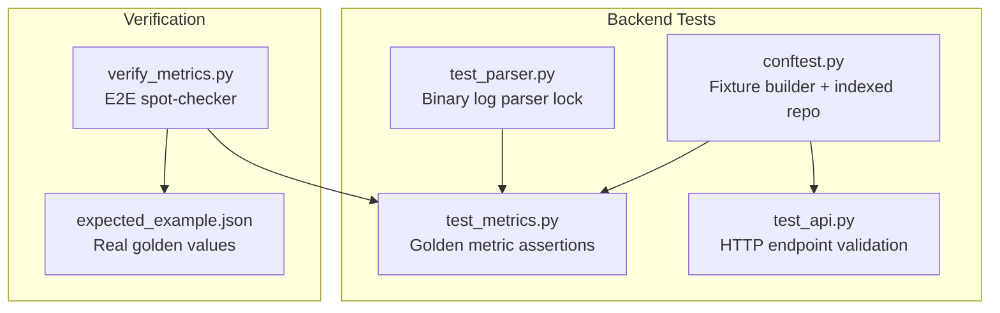
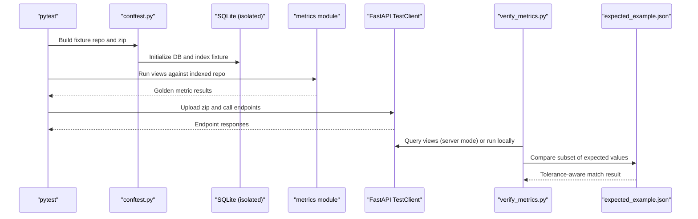
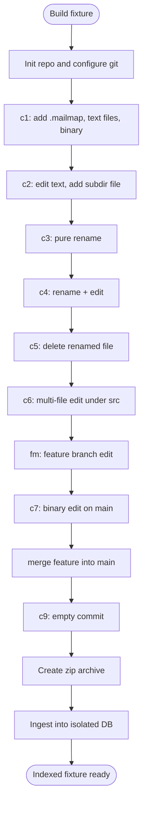
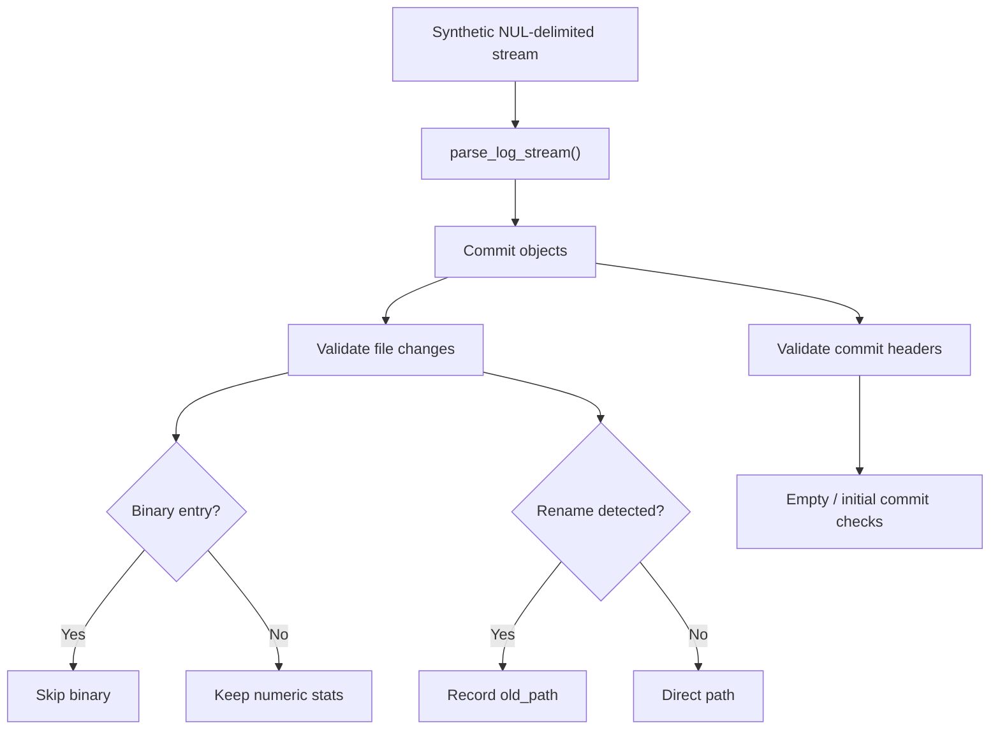
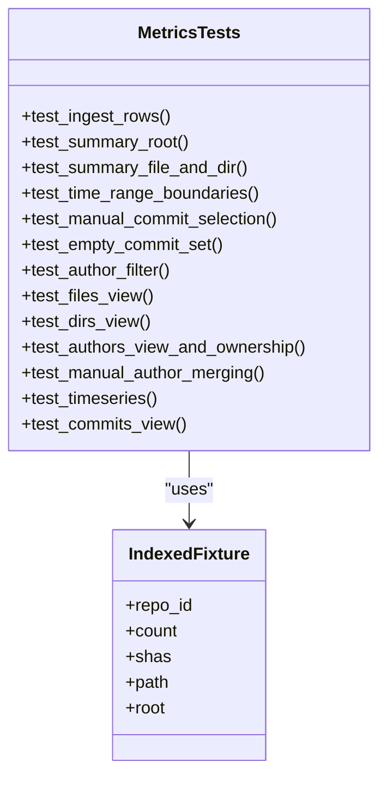
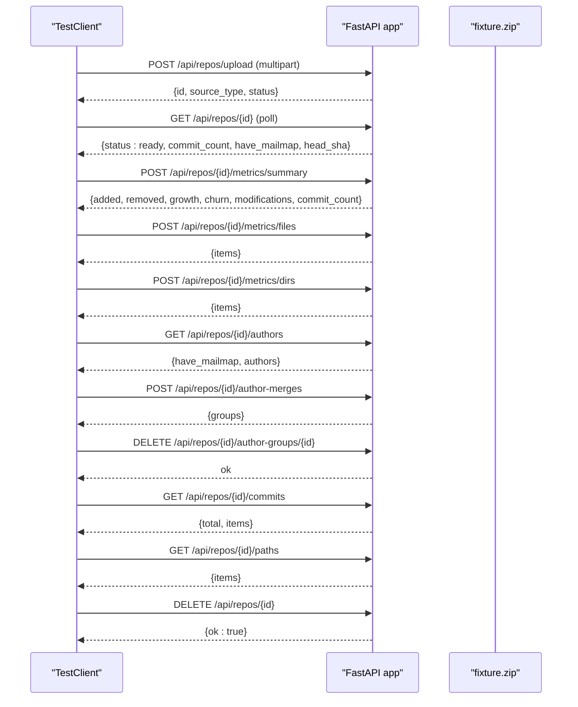
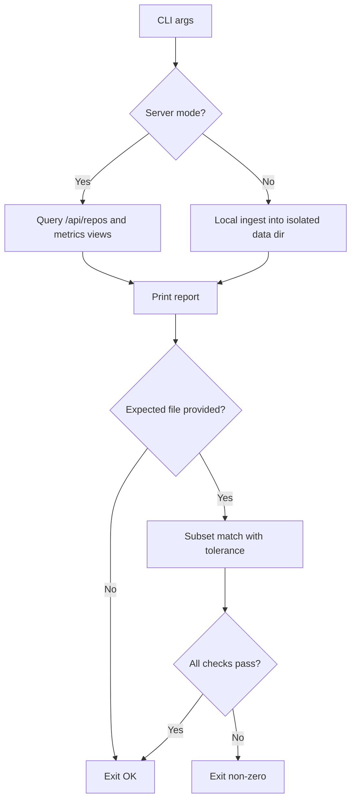
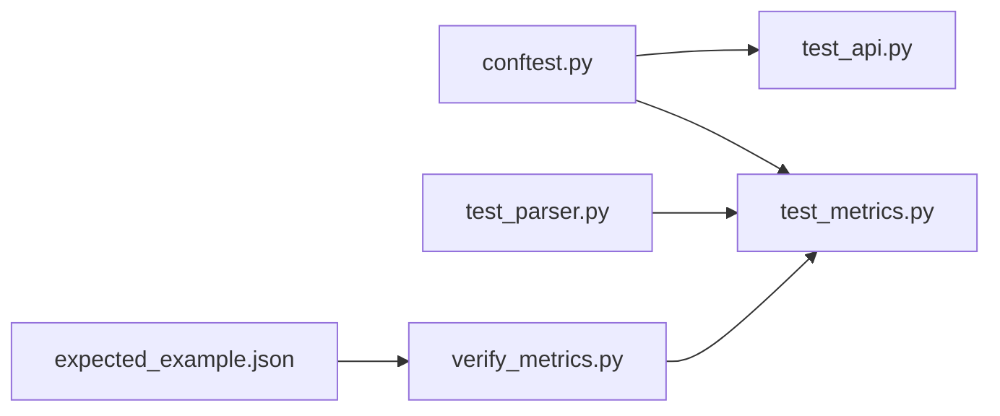

# Testing Strategy

<cite>
**Referenced Files in This Document**
- [README.md](file://README.md)
- [Makefile](file://Makefile)
- [backend/tests/conftest.py](file://backend/tests/conftest.py)
- [backend/tests/test_parser.py](file://backend/tests/test_parser.py)
- [backend/tests/test_metrics.py](file://backend/tests/test_metrics.py)
- [backend/tests/test_api.py](file://backend/tests/test_api.py)
- [scripts/verify_metrics.py](file://scripts/verify_metrics.py)
- [scripts/expected_example.json](file://scripts/expected_example.json)
</cite>

## Table of Contents
1. [Introduction](#introduction)
2. [Project Structure](#project-structure)
3. [Core Components](#core-components)
4. [Architecture Overview](#architecture-overview)
5. [Detailed Component Analysis](#detailed-component-analysis)
6. [Dependency Analysis](#dependency-analysis)
7. [Performance Considerations](#performance-considerations)
8. [Troubleshooting Guide](#troubleshooting-guide)
9. [Conclusion](#conclusion)
10. [Appendices](#appendices)

## Introduction
This document explains RAT’s comprehensive testing strategy. It covers:
- Deterministic fixture-based unit and integration tests
- Binary git log parser format locking
- Golden-value metrics validation against hand-computed expectations
- API endpoint validation using FastAPI’s test client
- End-to-end verification with expected-values matching
- Guidance for writing new tests, maintaining fixtures, debugging failures, and continuous integration considerations

The repository’s README describes the overall tool, metric definitions, quick start, API surface, verification workflow, performance characteristics, and project layout. The backend test suite is invoked through `make test`, and end-to-end spot checks are run through `make verify`.

**Section sources**
- [README.md:1-15](file://README.md#L1-L15)
- [README.md:67-84](file://README.md#L67-L84)
- [README.md:109-140](file://README.md#L109-L140)
- [README.md:142-166](file://README.md#L142-L166)
- [README.md:168-194](file://README.md#L168-L194)
- [README.md:196-206](file://README.md#L196-L206)
- [Makefile:1-23](file://Makefile#L1-L23)
- [Makefile:54-58](file://Makefile#L54-L58)

## Project Structure
RAT’s testing surface lives primarily under `backend/tests` and `scripts`:
- `backend/tests/conftest.py`: deterministic fixture repository builder and ingestion helpers
- `backend/tests/test_parser.py`: binary git log stream parser contract tests
- `backend/tests/test_metrics.py`: golden-value assertions over all metric views
- `backend/tests/test_api.py`: HTTP endpoint validation using FastAPI’s test client
- `scripts/verify_metrics.py`: end-to-end verification script with optional expected-values comparison
- `scripts/expected_example.json`: real-world golden values for a public repository

**Diagram sources**
- [backend/tests/conftest.py:1-21](file://backend/tests/conftest.py#L1-L21)
- [backend/tests/test_parser.py:1-7](file://backend/tests/test_parser.py#L1-L7)
- [backend/tests/test_metrics.py:1-5](file://backend/tests/test_metrics.py#L1-L5)
- [backend/tests/test_api.py:1-10](file://backend/tests/test_api.py#L1-L10)
- [scripts/verify_metrics.py:1-31](file://scripts/verify_metrics.py#L1-L31)
- [scripts/expected_example.json:1-37](file://scripts/expected_example.json#L1-L37)

**Section sources**
- [README.md:196-206](file://README.md#L196-L206)
- [Makefile:54-58](file://Makefile#L54-L58)

## Core Components
This section summarizes the core testing components and their responsibilities.

- Deterministic fixture repository builder
  - Creates a controlled git history with known authors, timestamps, renames, edits, deletions, binary files, merges, and empty commits.
  - Produces both an on-disk repository and a zip archive suitable for upload.
  - Ingests the fixture into an isolated SQLite database under a temporary data directory.

- Parser format tests
  - Locks the exact token format produced by `git log --numstat -z`.
  - Validates commit header parsing, file change records, binary skipping, rename semantics, unicode paths, deletions, empty commits, and initial commits.

- Golden metrics tests
  - Asserts ingest-level correctness (commit count, parent chains, mailmap application, rename attribution).
  - Validates summary, files, directories, authors, timeseries, and commits views against hand-computed expectations.
  - Exercises time-range boundaries, manual commit selection, author filtering, merge exclusion, and directory modification de-duplication.

- API tests
  - Uploads the fixture zip via the `/api/repos/upload` endpoint.
  - Polls until ingestion completes and validates repository metadata.
  - Exercises metrics endpoints, author merging endpoints, commit/path pickers, error handling, and cleanup.

- Verification script
  - Supports server mode (against a running API) and local mode (in-process indexing).
  - Runs standard views and prints a human-readable report.
  - Compares results to an expected-values JSON file with integer-exact and float-tolerant matching.

**Section sources**
- [backend/tests/conftest.py:1-21](file://backend/tests/conftest.py#L1-L21)
- [backend/tests/conftest.py:79-137](file://backend/tests/conftest.py#L79-L137)
- [backend/tests/conftest.py:140-175](file://backend/tests/conftest.py#L140-L175)
- [backend/tests/test_parser.py:1-72](file://backend/tests/test_parser.py#L1-L72)
- [backend/tests/test_metrics.py:1-310](file://backend/tests/test_metrics.py#L1-L310)
- [backend/tests/test_api.py:1-102](file://backend/tests/test_api.py#L1-L102)
- [scripts/verify_metrics.py:1-31](file://scripts/verify_metrics.py#L1-L31)
- [scripts/verify_metrics.py:194-241](file://scripts/verify_metrics.py#L194-L241)

## Architecture Overview
The testing architecture connects deterministic fixtures to multiple layers of validation:

**Diagram sources**
- [backend/tests/conftest.py:140-175](file://backend/tests/conftest.py#L140-L175)
- [backend/tests/test_metrics.py:16-21](file://backend/tests/test_metrics.py#L16-L21)
- [backend/tests/test_api.py:12-14](file://backend/tests/test_api.py#L12-L14)
- [scripts/verify_metrics.py:84-107](file://scripts/verify_metrics.py#L84-L107)
- [scripts/verify_metrics.py:114-150](file://scripts/verify_metrics.py#L114-L150)
- [scripts/verify_metrics.py:194-241](file://scripts/verify_metrics.py#L194-L241)

## Detailed Component Analysis

### Deterministic Fixture Builder
The fixture builder constructs a reproducible git history with precise timestamps and identities. It:
- Initializes a repository and configures deterministic behavior.
- Writes files, performs renames, edits, deletes, binary changes, branch merges, and empty commits.
- Records commit SHAs for later assertions.
- Exposes session-scoped fixtures for the repository path, zip archive, and an already-indexed repository record.

Key behaviors validated elsewhere:
- Merge commits are excluded from indexing.
- `.mailmap` aliases are applied at ingest.
- Pure renames produce no metric change; rename+edit attributes to the new path.
- Binary-only changes are not measured.
- Empty commits exist but contribute no file changes.

**Diagram sources**
- [backend/tests/conftest.py:79-137](file://backend/tests/conftest.py#L79-L137)
- [backend/tests/conftest.py:140-175](file://backend/tests/conftest.py#L140-L175)

**Section sources**
- [backend/tests/conftest.py:1-21](file://backend/tests/conftest.py#L1-L21)
- [backend/tests/conftest.py:79-137](file://backend/tests/conftest.py#L79-L137)
- [backend/tests/conftest.py:140-175](file://backend/tests/conftest.py#L140-L175)

### Parser Format Testing
The parser test locks the exact byte-level output of `git log --numstat -z`. It constructs a synthetic NUL-delimited stream containing:
- Normal additions
- Binary entries (skipped)
- Pure renames
- Rename+edit pairs
- Unicode filenames
- Deletions
- Empty commits
- Initial commits without parents

It asserts that the parser yields the correct number of commits, preserves header fields, applies rename semantics, decodes unicode, skips binary changes, and handles edge cases like empty and initial commits.

**Diagram sources**
- [backend/tests/test_parser.py:19-37](file://backend/tests/test_parser.py#L19-L37)
- [backend/tests/test_parser.py:40-72](file://backend/tests/test_parser.py#L40-L72)

**Section sources**
- [backend/tests/test_parser.py:1-72](file://backend/tests/test_parser.py#L1-L72)

### Metrics Validation Against Golden Values
The metrics test suite exercises every major view and formula:
- Ingest-level checks: commit counts, parent chains, mailmap aliasing, rename attribution, binary exclusion, empty commit handling.
- Repository and file/directory summaries: added, removed, growth, churn, modifications, modification frequency, churn rate.
- Commit-set filters: time-range boundaries (`H_i,j`), manual commit lists, empty sets, author filters.
- Files and directories: per-path metrics, directory aggregation, per-commit modification de-duplication.
- Authors: ownership ratios, merged identities, unmerge operations, author filter keys.
- Timeseries and commits views: bucketing, ordering, pagination, scoped commit lists.

**Diagram sources**
- [backend/tests/test_metrics.py:31-75](file://backend/tests/test_metrics.py#L31-L75)
- [backend/tests/test_metrics.py:81-103](file://backend/tests/test_metrics.py#L81-L103)
- [backend/tests/test_metrics.py:109-145](file://backend/tests/test_metrics.py#L109-L145)
- [backend/tests/test_metrics.py:160-206](file://backend/tests/test_metrics.py#L160-L206)
- [backend/tests/test_metrics.py:212-283](file://backend/tests/test_metrics.py#L212-L283)
- [backend/tests/test_metrics.py:289-310](file://backend/tests/test_metrics.py#L289-L310)

**Section sources**
- [backend/tests/test_metrics.py:1-310](file://backend/tests/test_metrics.py#L1-L310)

### API Testing Approach
API tests use FastAPI’s `TestClient` to drive the full ingestion lifecycle and endpoint contracts:
- Upload the fixture zip and wait for readiness.
- Validate repository metadata such as commit count and mailmap presence.
- Exercise metrics endpoints for summary, files, dirs, authors, timeseries, and commits.
- Perform manual author merges and verify resulting metrics.
- Use commit and path picker endpoints.
- Validate error responses and cleanup behavior.

**Diagram sources**
- [backend/tests/test_api.py:12-14](file://backend/tests/test_api.py#L12-L14)
- [backend/tests/test_api.py:17-27](file://backend/tests/test_api.py#L17-L27)
- [backend/tests/test_api.py:29-96](file://backend/tests/test_api.py#L29-L96)

**Section sources**
- [backend/tests/test_api.py:1-102](file://backend/tests/test_api.py#L1-L102)

### Expected Values Validation System
The verification script supports two modes:
- Server mode: queries a running API for repository data and metrics.
- Local mode: ingests in-process into an isolated data directory.

It runs standard views and compares selected metrics against `scripts/expected_example.json`:
- Summary-level metrics are compared directly.
- Per-row metrics for files, directories, and authors are matched by key.
- Integer comparisons are exact; floating-point comparisons use a tight tolerance.

**Diagram sources**
- [scripts/verify_metrics.py:84-107](file://scripts/verify_metrics.py#L84-L107)
- [scripts/verify_metrics.py:114-150](file://scripts/verify_metrics.py#L114-L150)
- [scripts/verify_metrics.py:157-191](file://scripts/verify_metrics.py#L157-L191)
- [scripts/verify_metrics.py:194-241](file://scripts/verify_metrics.py#L194-L241)
- [scripts/verify_metrics.py:246-288](file://scripts/verify_metrics.py#L246-L288)
- [scripts/expected_example.json:1-37](file://scripts/expected_example.json#L1-L37)

**Section sources**
- [scripts/verify_metrics.py:1-31](file://scripts/verify_metrics.py#L1-L31)
- [scripts/verify_metrics.py:194-241](file://scripts/verify_metrics.py#L194-L241)
- [scripts/expected_example.json:1-37](file://scripts/expected_example.json#L1-L37)

## Dependency Analysis
The test suite has clear dependencies:
- `test_metrics.py` depends on `conftest.py` for the indexed fixture and on the metrics module for view execution.
- `test_api.py` depends on `conftest.py` for the fixture zip and on the FastAPI test client.
- `test_parser.py` depends on the ingest parser implementation.
- `verify_metrics.py` depends on either the running API or the backend modules when run locally.

**Diagram sources**
- [backend/tests/conftest.py:140-175](file://backend/tests/conftest.py#L140-L175)
- [backend/tests/test_metrics.py:10-14](file://backend/tests/test_metrics.py#L10-L14)
- [backend/tests/test_api.py:6-10](file://backend/tests/test_api.py#L6-L10)
- [backend/tests/test_parser.py:10-10](file://backend/tests/test_parser.py#L10-L10)
- [scripts/verify_metrics.py:114-150](file://scripts/verify_metrics.py#L114-L150)

**Section sources**
- [backend/tests/test_metrics.py:10-14](file://backend/tests/test_metrics.py#L10-L14)
- [backend/tests/test_api.py:6-10](file://backend/tests/test_api.py#L6-L10)
- [backend/tests/test_parser.py:10-10](file://backend/tests/test_parser.py#L10-L10)
- [scripts/verify_metrics.py:114-150](file://scripts/verify_metrics.py#L114-L150)

## Performance Considerations
Testing should reflect the system’s performance characteristics:
- The fixture is small and deterministic, enabling fast unit and integration tests.
- The parser test uses a synthetic stream to avoid external process overhead.
- API tests poll for readiness with a timeout to handle background ingestion.
- The verification script can operate against a live server or locally; local mode avoids network latency but incurs indexing cost.
- The README documents measured query latencies and indexing throughput, which inform realistic expectations for CI timing.

[No sources needed since this section provides general guidance]

## Troubleshooting Guide
Common issues and how to address them:

- Fixture build failures
  - Ensure `git` is available and configured deterministically.
  - Check environment variables set for author identity and timestamps.
  - Verify that the isolated data directory is writable.

- Parser test failures
  - Confirm the parser still matches the locked binary token format.
  - Inspect the synthetic stream structure and ensure it mirrors real `git log --numstat -z` output.

- Metrics assertion failures
  - Revisit the fixture history and hand-computed expectations.
  - Pay attention to boundary conditions: time ranges, manual commit lists, author merges, and directory de-duplication.

- API test timeouts
  - Increase the readiness polling timeout if ingestion takes longer than expected.
  - Check repository ingestion logs and error states returned by the API.

- Verification script failures
  - For server mode, confirm the server URL and repository name/id.
  - For local mode, ensure the data directory is isolated and writable.
  - Update `scripts/expected_example.json` only after verifying the underlying data changed intentionally.

**Section sources**
- [backend/tests/conftest.py:31-38](file://backend/tests/conftest.py#L31-L38)
- [backend/tests/test_parser.py:1-7](file://backend/tests/test_parser.py#L1-L7)
- [backend/tests/test_metrics.py:109-145](file://backend/tests/test_metrics.py#L109-L145)
- [backend/tests/test_api.py:17-27](file://backend/tests/test_api.py#L17-L27)
- [scripts/verify_metrics.py:84-107](file://scripts/verify_metrics.py#L84-L107)
- [scripts/verify_metrics.py:114-150](file://scripts/verify_metrics.py#L114-L150)

## Conclusion
RAT’s testing strategy combines deterministic fixtures, strict parser format locking, golden-value metrics validation, and robust API and end-to-end verification. The fixture builder ensures reproducibility, while the parser and metrics tests protect core logic. API tests validate user-facing contracts, and the verification script anchors real-world correctness against hand-computed expectations. Together, these layers provide confidence across unit, integration, and end-to-end scenarios.

[No sources needed since this section summarizes without analyzing specific files]

## Appendices

### How to Write New Tests
- Unit tests for metrics
  - Use the indexed fixture from `conftest.py`.
  - Call the metrics view helper and assert against hand-computed expectations.
  - Cover edge cases: empty commit sets, boundary dates, author merges, and directory de-duplication.

- Parser tests
  - Extend the synthetic stream to cover new input shapes.
  - Assert commit headers, file changes, rename semantics, and edge cases.

- API tests
  - Use `TestClient` to exercise endpoints.
  - Wait for ingestion readiness and validate responses.
  - Include error path assertions and cleanup steps.

- Verification expectations
  - Update `scripts/expected_example.json` only after confirming the underlying repository state changed intentionally.
  - Keep expectations minimal and focused on critical metrics.

**Section sources**
- [backend/tests/test_metrics.py:16-21](file://backend/tests/test_metrics.py#L16-L21)
- [backend/tests/test_parser.py:19-37](file://backend/tests/test_parser.py#L19-L37)
- [backend/tests/test_api.py:12-14](file://backend/tests/test_api.py#L12-L14)
- [scripts/expected_example.json:1-37](file://scripts/expected_example.json#L1-L37)

### Maintaining Test Fixtures
- Keep the fixture history concise and representative.
- Update timestamps and identities consistently.
- Reflect any semantic changes in the ingestion pipeline (e.g., rename detection, binary handling).
- Regenerate the zip archive when the repository content changes.

**Section sources**
- [backend/tests/conftest.py:79-137](file://backend/tests/conftest.py#L79-L137)
- [backend/tests/conftest.py:145-150](file://backend/tests/conftest.py#L145-L150)

### Continuous Integration Considerations
- Run `make test` to execute the backend test suite.
- Optionally run `make verify` with appropriate arguments to spot-check metrics against a server or local data directory.
- Cache dependencies and isolate data directories to keep runs fast and deterministic.
- Fail the pipeline on verification mismatches when expected values are supplied.

**Section sources**
- [Makefile:54-58](file://Makefile#L54-L58)
- [README.md:142-166](file://README.md#L142-L166)